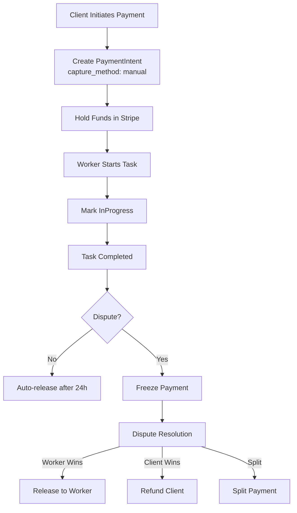
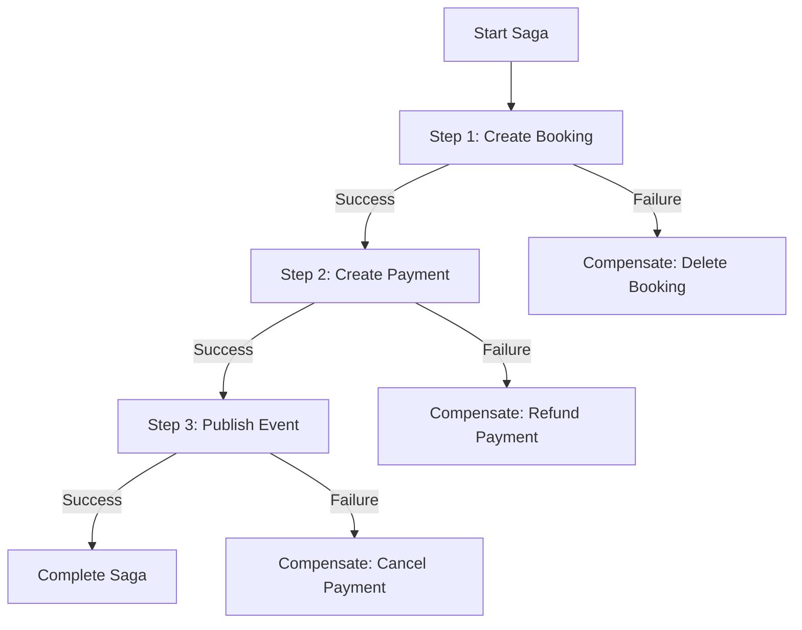

# Labor Marketplace System Design (Revised)

## Document Information
- **Version**: 2.0
- **Last Updated**: March 2026
- **Status**: Enhanced with missing components

---

## 1. Executive Summary

### 1.1 Overview
A full-featured ASP.NET MVC web application connecting task posters and workers for local, physical labor tasks with integrated payment escrow, real-time communication, and verification systems.

### 1.2 Target Users
- **Task Posters**: Homeowners, small businesses, event organizers
- **Workers**: Students, freelancers, skilled tradespeople
- **Administrators**: Platform moderators, dispute resolution agents

---

## 2. Problem Statement

### 2.1 Market Gap
Finding reliable local labor for short-term tasks remains fragmented and trust-deficient:
- Homeowners need help with moving, cleaning, repairs, gardening
- Small businesses require temporary staff for events, inventory, or projects
- Workers seek flexible, fairly compensated opportunities

### 2.2 Existing Solution Limitations
| Platform Type | Limitations |
|--------------|-------------|
| General Freelance (Upwork, Fiverr) | Not suited for physical, location-based labor |
| Classified Ads (Craigslist, Facebook) | Lack verification, safety, structured workflows |
| Gig Economy Apps | Limited to specific categories (Uber, TaskRabbit) |

### 2.3 Core Challenges Addressed
- [x] Worker verification and trust establishment
- [x] Task posting and discovery with location awareness
- [x] Scheduling and conflict prevention
- [x] Secure payments with escrow protection
- [x] Dispute resolution and ratings
- [x] Real-time communication

---

## 3. Enhanced Core Features

### 3.1 Must-Have Features

| Feature | Description | Implementation Status |
|---------|-------------|----------------------|
| **User Roles** | Task Poster (client) and Worker (laborer) with role-based access | ✅ Implemented |
| **Task Posting** | Category, description, location (map), date/time, budget type | ✅ Implemented |
| **Worker Discovery** | Search by location (radius), category, date, budget with ranking | ✅ Implemented |
| **Task Application** | Workers apply with message and proposed rate | ✅ Implemented |
| **Booking & Scheduling** | Booking creation with overlap prevention (concurrency) | ✅ Implemented |
| **In-app Messaging** | Real-time chat via SignalR | ✅ Implemented |
| **Payments (Escrow)** | Stripe Connect integration with hold/release | ✅ Implemented |
| **Ratings & Reviews** | 1-5 stars with comments, mutual rating system | ✅ Implemented |
| **Basic Verification** | Email, phone, optional ID upload | ✅ Implemented |
| **Soft Deletes** | Logical deletion with audit trail | ✅ Implemented |
| **Audit Logging** | Created/Updated timestamps and user tracking | ✅ Implemented |

### 3.2 Advanced Features (NEW)

| Feature | Priority | Description |
|---------|----------|-------------|
| **Distributed Transactions** | High | Outbox pattern with Saga orchestration for payment flows |
| **Caching Layer** | High | Redis for session state, task listings, user profiles |
| **Background Jobs** | High | Hangfire for payment auto-release, reminders, no-show detection |
| **API Rate Limiting** | Medium | Prevent abuse and ensure fair usage |
| **Webhook Management** | High | Stripe webhook handling with idempotency |
| **Geolocation Check-in** | Medium | GPS verification for hourly tasks |
| **Push Notifications** | Medium | Real-time alerts for messages, booking updates |
| **Analytics Dashboard** | Low | Admin insights on platform usage, revenue |
| **Bulk Operations** | Low | Admin bulk actions for user management |

### 3.3 Future Roadmap
- [ ] Mobile App (iOS/Android)
- [ ] AI-powered task matching
- [ ] Background check integration
- [ ] Insurance add-ons
- [ ] Multi-language support (i18n)
- [ ] Blockchain-based reputation system

---

## 4. Updated Technology Stack

### 4.1 Current Stack

| Layer | Technology | Version |
|-------|------------|---------|
| **Framework** | ASP.NET Core MVC | .NET 9.0 |
| **Frontend** | Razor Views, Bootstrap 5, jQuery | Latest |
| **Database** | SQL Server | 2019+ |
| **ORM** | Entity Framework Core | 9.0 |
| **Spatial** | NetTopologySuite | Latest |
| **Real-time** | SignalR | Latest |
| **Background Jobs** | Hangfire | Latest |
| **Payments** | Stripe Connect | Latest |
| **Authentication** | ASP.NET Core Identity | Latest |
| **Caching** | Redis (optional) | Latest |
| **Logging** | Serilog | Latest |
| **Mapping** | AutoMapper | Latest |

### 4.2 Infrastructure (NEW)

| Component | Technology | Purpose |
|-----------|------------|---------|
| **Load Balancer** | Azure Load Balancer / Nginx | Traffic distribution |
| **CDN** | Azure CDN / CloudFlare | Static asset delivery |
| **File Storage** | Azure Blob Storage / AWS S3 | Document uploads, images |
| **Monitoring** | Application Insights / Datadog | Performance monitoring |
| **Secrets Management** | Azure Key Vault / AWS Secrets Manager | Secure configuration |

---

## 5. Enhanced Architecture Overview

### 5.1 N-Tier Architecture with Microservices-Ready Design

```
┌─────────────────────────────────────────────────────────────┐
│                    PRESENTATION LAYER                        │
│    Razor Views + JavaScript (jQuery, SignalR Client)        │
└───────────────────────────┬─────────────────────────────────┘
                            │
┌───────────────────────────▼─────────────────────────────────┐
│                   API GATEWAY (Future)                       │
│         Rate Limiting, Authentication, Routing              │
└───────────────────────────┬─────────────────────────────────┘
                            │
┌───────────────────────────▼─────────────────────────────────┐
│                  CONTROLLERS LAYER                           │
│  AccountController, TaskController, BookingController,      │
│  PaymentController, MessageController, AdminController      │
└───────────────────────────┬─────────────────────────────────┘
                            │
┌───────────────────────────▼─────────────────────────────────┐
│              BUSINESS LOGIC LAYER (BLL)                      │
│     Services (TaskService, BookingService, PaymentService)  │
│     ├─ Distributed Transaction Service (Saga)               │
│     ├─ Outbox Processor                                     │
│     ├─ Notification Service                                 │
│     └─ Verification Service                                 │
└───────────────────────────┬─────────────────────────────────┘
                            │
┌───────────────────────────▼─────────────────────────────────┐
│              DATA ACCESS LAYER (DAL)                         │
│     Repositories, Unit of Work, DbContext, Entities         │
│     ├─ Soft Delete Pattern                                  │
│     ├─ Audit Trail                                          │
│     └─ Spatial Data Support                                 │
└───────────────────────────┬─────────────────────────────────┘
                            │
┌───────────────────────────▼─────────────────────────────────┐
│              INFRASTRUCTURE LAYER                            │
│     Caching (Redis), File Storage, Email/SMS, Push          │
└─────────────────────────────────────────────────────────────┘
```

### 5.2 Key Design Patterns Used

| Pattern | Purpose | Implementation |
|---------|---------|----------------|
| **Repository** | Data access abstraction | Generic + Specific repositories |
| **Unit of Work** | Transaction management | Custom UoW with async support |
| **Saga** | Distributed transactions | Saga orchestrator for payment flows |
| **Outbox** | Reliable message delivery | Outbox pattern for event publishing |
| **State Machine** | Workflow management | Payment, Booking, Dispute states |
| **CQRS** (Partial) | Read/Write separation | Separate query models |

---

## 6. Enhanced Database Schema

### 6.1 Core Entities

#### AspNetUsers (Extended)
```sql
- Id (PK, string)
- FirstName, LastName
- Email, PhoneNumber, PhoneConfirmed
- IDVerified (bool)
- AverageRating (decimal)
- VerificationTier (enum: None, Basic, Verified, Premium)
- StripeAccountId (string)
- LocationGeography (geography) -- NEW: Spatial type
- CreatedAt, UpdatedAt, DeletedAt (soft delete)
- CreatedBy, UpdatedBy, DeletedBy (audit)
- IsDeleted (bool)
- HasVisa (bool) -- NEW
- Skills (string) -- JSON array
- Bio (string)
```

#### Tasks
```sql
- Id (PK, int)
- PosterId (FK)
- Category (enum)
- Title, Description
- LocationGeography (geography) -- Spatial
- Location (string) -- Human readable
- Latitude, Longitude
- ScheduledStart, ScheduledEnd
- BudgetType (Fixed/Hourly)
- BudgetAmount
- Status (Open, Assigned, InProgress, Completed, Cancelled, Disputed)
- IsUrgent (bool)
- IsFeatured (bool)
- IsRemote (bool)
- ViewCount (int)
- AttachmentUrls (string) -- JSON array
- CreatedAt, UpdatedAt
- SoftDelete + Audit fields
```

#### TaskApplications
```sql
- Id (PK, int)
- TaskId (FK)
- WorkerId (FK)
- ProposedRate
- Message
- Status (Pending, Accepted, Rejected, Withdrawn)
- ViewedAt (datetime)
- RespondedAt (datetime)
- RejectionReason
- CreatedAt, UpdatedAt
```

#### Bookings
```sql
- Id (PK, int)
- TaskId (FK)
- WorkerId (FK)
- PosterId (FK) -- NEW: Denormalized for queries
- AgreedRate
- StartTime, EndTime (actual)
- Status (Scheduled, InProgress, Completed, Cancelled, Disputed)
- RowVersion (timestamp) -- Concurrency
- CreatedAt, UpdatedAt
- SoftDelete + Audit fields
```

#### Payments (Enhanced)
```sql
- Id (PK, int)
- BookingId (FK)
- UserId (FK) -- Who made payment
- Amount
- Currency (default: USD)
- Status (Pending, Held, Released, Refunded, PartiallyRefunded, Failed)
- PaymentType (Escrow, PlatformFee, Refund)
- PaymentMethod (Stripe, etc.)
- TransactionId (Stripe PaymentIntent ID)
- ClientSecret (for Stripe Elements)
- IdempotencyKey (prevent duplicates)
- BillingName, BillingEmail, BillingAddress
- ReleasedAt, ProcessedDate
- Notes
- ErrorMessage (for failed payments)
- CreatedAt, UpdatedAt
```

#### PaymentAuditLog (NEW)
```sql
- Id (PK, int)
- PaymentId (FK)
- Action (Created, Captured, Released, Refunded, Failed)
- Amount
- PerformedBy (user or system)
- Timestamp
- Details (JSON)
```

#### OutboxMessages (NEW - Distributed Transactions)
```sql
- Id (PK, int)
- MessageType (string)
- Payload (JSON)
- Status (Pending, Processing, Completed, Failed, DeadLetter)
- RetryCount, MaxRetryCount
- ScheduledAt, ProcessedAt, CompletedAt
- ErrorMessage, ErrorStackTrace
- CorrelationId (for tracing)
- AggregateId, AggregateType
- LockToken, LockExpiryAt (for distributed processing)
- Headers (JSON)
```

#### PendingTransfers (NEW - Worker Payouts)
```sql
- Id (PK, int)
- PaymentId (FK)
- BookingId (FK)
- WorkerId (FK)
- WorkerStripeAccountId
- Amount
- Currency
- PlatformFeeAmount
- Status (Pending, Processing, Completed, Failed, Cancelled)
- StripeTransferId
- TransferGroup
- RetryCount, MaxRetryCount
- NextRetryAt, LastAttemptAt
- ErrorMessage
- LockToken, LockExpiryAt
- CompletedAt
- CreatedAt
```

#### SagaInstances (NEW - Long-running transactions)
```sql
- Id (PK, int)
- SagaType (string)
- SagaId (GUID)
- Status (Started, Running, Completed, Failed, Compensating, Compensated)
- CurrentStep
- InputData (JSON)
- ResultData (JSON)
- ErrorMessage
- StartedAt, CompletedAt
- LastActivityAt
- RetryCount
```

#### Disputes
```sql
- Id (PK, int)
- BookingId (FK)
- RaisedBy (FK to User)
- Reason
- Status (Open, UnderReview, Resolved, Escalated)
- ResolutionType (RefundPoster, PayWorker, Split, None)
- ResolutionNotes
- AdminId (FK)
- EvidenceUrls (JSON)
- CreatedAt, ResolvedAt
```

#### Messages
```sql
- Id (PK, int)
- BookingId (FK)
- SenderId (FK)
- Content
- SentAt
- IsRead
- ReadAt
```

#### Ratings
```sql
- Id (PK, int)
- BookingId (FK, unique)
- RaterId (FK)
- RatedId (FK)
- Rating (1-5)
- Comment
- CreatedAt
```

### 6.2 Indexes for Performance

```sql
-- Spatial index for location-based queries
CREATE SPATIAL INDEX IX_Tasks_Location ON Tasks(LocationGeography);

-- Composite index for task filtering
CREATE INDEX IX_Tasks_Status_Category_IsDeleted ON Tasks(Status, Category, IsDeleted) INCLUDE (CreatedAt, BudgetAmount);

-- Index for worker's bookings
CREATE INDEX IX_Bookings_WorkerId_Status ON Bookings(WorkerId, Status) INCLUDE (StartTime, EndTime);

-- Index for payment lookups
CREATE INDEX IX_Payments_BookingId_Status ON Payments(BookingId, Status);

-- Index for outbox message processing
CREATE INDEX IX_OutboxMessages_Status_ScheduledAt ON OutboxMessages(Status, ScheduledAt) WHERE Status IN (0, 3);
```

---

## 7. Critical Business Rules & Workflows

### 7.1 Booking Overlap Prevention

**Rule**: Worker cannot have overlapping bookings

**Implementation**:
```csharp
// Pseudo-code for overlap check
var hasOverlap = await _bookingRepo.ExistsAsync(b =>
    b.WorkerId == workerId &&
    b.Status != BookingStatus.Cancelled &&
    b.StartTime < newBooking.EndTime &&
    b.EndTime > newBooking.StartTime);
```

**Concurrency**: Use RowVersion for optimistic locking

### 7.2 Escrow Payment Flow (Enhanced)



### 7.3 Distributed Transaction Pattern (NEW)

**Scenario**: Payment + Booking Creation + Notification



### 7.4 Cancellation Rules

| Cancelled By | Timing | Penalty |
|-------------|--------|---------|
| Client | > 24h before | Full refund |
| Client | 2-24h before | 25% to worker |
| Client | < 2h before | 50% to worker |
| Worker | Anytime | Rating penalty, strike |
| No-show | After start + 30min | Full penalty, suspension |

### 7.5 Rating System Rules

1. **Mutual Rating**: Both parties must rate before scores are visible
2. **Time Window**: 14 days to rate after completion
3. **One per Booking**: Single rating per party per booking
4. **Weighted Average**: Recent ratings weighted more heavily
5. **Anomaly Detection**: Flag suspicious rating patterns

---

## 8. Security & Compliance (NEW SECTION)

### 8.1 Authentication & Authorization
- ASP.NET Core Identity with JWT support
- Role-based: Admin, Poster, Worker
- Policy-based authorization for features
- Two-factor authentication (optional)

### 8.2 Data Protection
- **At Rest**: SQL Server TDE encryption
- **In Transit**: HTTPS/TLS 1.3
- **PII**: Encrypted fields for sensitive data
- **Passwords**: PBKDF2 with salt

### 8.3 Compliance
- **GDPR**: Right to erasure, data portability
- **PCI DSS**: Stripe handles card data (SAQ A)
- **COPPA**: Age verification for users under 13

### 8.4 Security Measures
- CSRF tokens on all forms
- Rate limiting on API endpoints
- Input validation (client + server)
- SQL injection prevention (EF parameterized queries)
- XSS protection (Razor auto-encoding)
- Security headers (HSTS, CSP, X-Frame-Options)

---

## 9. Scalability & Performance (NEW SECTION)

### 9.1 Caching Strategy

| Cache Type | Technology | TTL | Use Case |
|------------|------------|-----|----------|
| Distributed | Redis | 5 min | Task listings, user sessions |
| Response | Output Cache | 1 min | Static pages |
| Entity | EF Second Level | 10 min | Reference data |

### 9.2 Database Optimization
- Read replicas for reporting queries
- Connection pooling (max 100 connections)
- Query result caching for expensive operations
- Async/await throughout data access

### 9.3 Horizontal Scaling
- Stateless application design
- Session stored in Redis (not in-memory)
- File uploads to blob storage (not local disk)
- SignalR backplane with Redis for multi-instance

---

## 10. Monitoring & Observability (NEW SECTION)

### 10.1 Logging
- **Framework**: Serilog with structured logging
- **Sinks**: Console, File, Application Insights
- **Correlation IDs**: Trace requests across services
- **Sensitive Data**: Masked in logs

### 10.2 Metrics to Track
- Request latency (p50, p95, p99)
- Database query performance
- Payment success/failure rates
- Background job execution times
- User registration conversion funnel

### 10.3 Alerting
- Error rate > 1% for 5 minutes
- Payment processing failures
- Database connection pool exhaustion
- Background job queue depth

---

## 11. Testing Strategy (NEW SECTION)

### 11.1 Test Types
| Type | Framework | Coverage |
|------|-----------|----------|
| Unit | xUnit, Moq | Business logic, services |
| Integration | TestServer | Controllers, repositories |
| E2E | Playwright/Selenium | Critical user flows |
| Load | k6/JMeter | Payment, booking flows |

### 11.2 Critical Test Scenarios
1. Double-booking prevention under concurrent load
2. Payment idempotency
3. Saga compensation on failure
4. Dispute resolution workflow
5. Rate limiting effectiveness

---

## 12. Deployment & DevOps (NEW SECTION)

### 12.1 CI/CD Pipeline
```
Code Commit → Build → Unit Tests → Integration Tests → 
Deploy to Staging → E2E Tests → Deploy to Production
```

### 12.2 Environments
- **Development**: Local developer machines
- **Staging**: Azure App Service (scaled down)
- **Production**: Azure App Service (auto-scaling)

### 12.3 Database Migrations
- EF Core Migrations
- Run on deployment (with backup)
- Idempotent scripts for safety

---

## 13. Missing Components Summary

### 13.1 Currently Implemented But Not Documented
1. ✅ Distributed Transactions (Saga + Outbox)
2. ✅ Soft Delete Pattern
3. ✅ Audit Logging
4. ✅ Payment Audit Trail
5. ✅ Retry Logic with Exponential Backoff
6. ✅ Idempotency Keys

### 13.2 Recommended for Future Implementation
1. 🔄 Multi-factor Authentication
2. 🔄 Push Notifications (Firebase/OneSignal)
3. 🔄 AI-powered task matching
4. 🔄 Advanced analytics dashboard
5. 🔄 Bulk operations for admin
6. 🔄 API versioning strategy
7. 🔄 GraphQL endpoint for mobile
8. 🔄 Blockchain reputation system
9. 🔄 Video verification for workers
10. 🔄 Insurance integration

### 13.3 Infrastructure Gaps
1. 🔄 CDN for static assets
2. 🔄 WAF (Web Application Firewall)
3. 🔄 DDoS protection
4. 🔄 Automated backups with retention policy
5. 🔄 Disaster recovery plan

---

## 14. Conclusion

This revised system design provides a comprehensive blueprint for the Labor Marketplace application. The architecture supports:

- **Scalability**: Horizontal scaling with stateless design
- **Reliability**: Distributed transactions, retry logic, circuit breakers
- **Security**: Defense in depth, compliance-ready
- **Maintainability**: Clean architecture, comprehensive logging

### Key Improvements Over Original Design:
1. Added distributed transaction support (Saga + Outbox)
2. Comprehensive security section
3. Performance optimization strategies
4. Monitoring and observability
5. Testing strategy
6. Deployment pipeline
7. Future roadmap

### Next Steps:
1. Implement missing infrastructure components
2. Add comprehensive integration tests
3. Set up monitoring and alerting
4. Plan mobile app development
5. Evaluate AI/ML integration opportunities

---

**Document Control**
- Authors: Development Team
- Reviewers: Architecture Team, Security Team
- Approvers: Product Owner, CTO