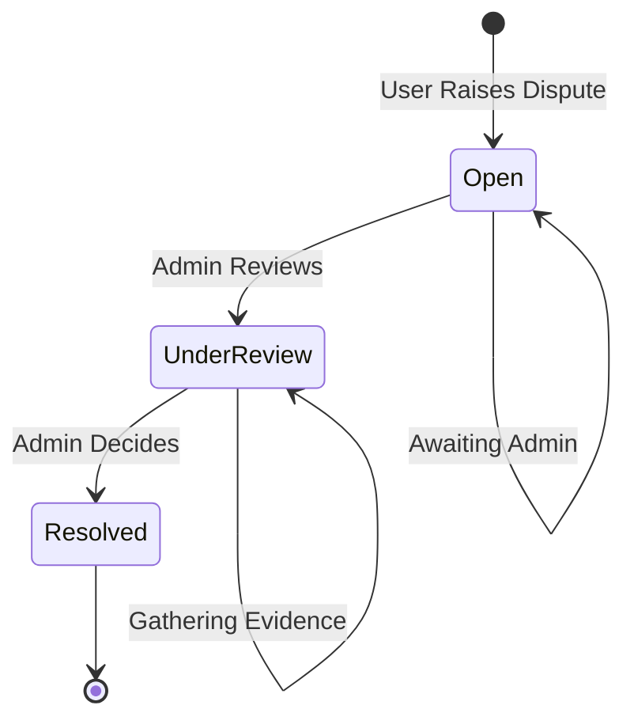
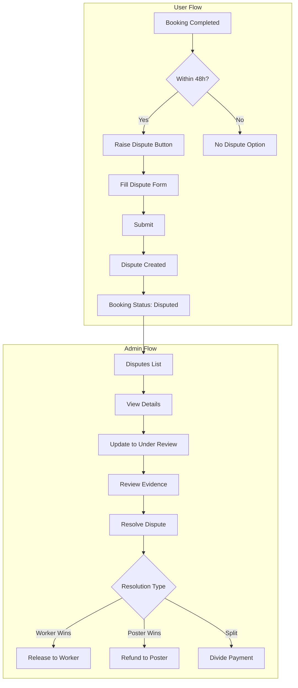

# Dispute Feature Implementation Plan

## Overview

This plan outlines the implementation of a complete Dispute Resolution system for the Labor Marketplace. Disputes allow users (Posters or Workers) to raise issues about completed bookings when conflicts arise.

## Business Requirements

### When Can Disputes Be Raised?
- Within **48 hours** of booking completion
- Only for bookings with `Completed` status
- One dispute per booking maximum

### Dispute Workflow



### Resolution Outcomes
1. **Worker Wins** - Full payment released to worker
2. **Poster Wins** - Full refund to poster
3. **Split Decision** - 50/50 payment division
4. **Custom Split** - Admin specifies percentage

---

## Implementation Components

### 1. Database Layer

#### 1.1 DisputeStatus Enum
**File:** `LaborDAL/Enums/DisputeStatus.cs`

```csharp
namespace LaborDAL.Enums
{
    public enum DisputeStatus
    {
        Open = 1,           // Newly raised, awaiting admin
        UnderReview = 2,    // Admin is investigating
        Resolved = 3        // Admin has made decision
    }
}
```

#### 1.2 Dispute Entity
**File:** `LaborDAL/Entities/Dispute.cs`

| Property | Type | Description |
|----------|------|-------------|
| Id | int | Primary key |
| BookingId | int | FK to Bookings |
| RaisedBy | string | FK to AspNetUsers |
| Reason | string | Description of the issue |
| Status | DisputeStatus | Current status |
| Resolution | string? | Admin's resolution notes |
| ResolutionType | ResolutionType? | How dispute was resolved |
| WorkerPercentage | int? | Percentage worker receives |
| ResolvedBy | string? | FK to Admin who resolved |
| ResolvedAt | DateTime? | When resolved |
| CreatedAt | DateTime | When raised |
| UpdatedAt | DateTime? | Last update |

#### 1.3 ResolutionType Enum
**File:** `LaborDAL/Enums/ResolutionType.cs`

```csharp
namespace LaborDAL.Enums
{
    public enum ResolutionType
    {
        WorkerWins = 1,     // Full payment to worker
        PosterWins = 2,     // Full refund to poster
        SplitEvenly = 3,    // 50/50 split
        CustomSplit = 4     // Admin-defined percentage
    }
}
```

### 2. Repository Layer

#### 2.1 IDisputeRepository Interface
**File:** `LaborDAL/Repo/Abstract/IDisputeRepo.cs`

Key methods:
- `GetByIdAsync(int id)`
- `GetByBookingIdAsync(int bookingId)`
- `GetDisputesByStatusAsync(DisputeStatus status)`
- `GetDisputesByUserAsync(string userId)`
- `GetAllDisputesAsync()`

#### 2.2 DisputeRepository Implementation
**File:** `LaborDAL/Repo/Implementation/DisputeRepo.cs`

### 3. Service Layer

#### 3.1 IDisputeService Interface
**File:** `LaborBLL/Service/Abstract/IDisputeService.cs`

```csharp
public interface IDisputeService
{
    // For users
    Task<Response<DisputeDetailsViewModel>> RaiseDisputeAsync(CreateDisputeViewModel model);
    Task<DisputeDetailsViewModel?> GetDisputeDetailsAsync(int disputeId);
    Task<IEnumerable<DisputeListViewModel>> GetUserDisputesAsync(string userId);
    
    // For admin
    Task<IEnumerable<DisputeListViewModel>> GetAllDisputesAsync(DisputeStatus? status = null);
    Task<Response<bool>> UpdateStatusAsync(int disputeId, DisputeStatus status);
    Task<Response<bool>> ResolveDisputeAsync(ResolveDisputeViewModel model);
    
    // Validation
    Task<bool> CanRaiseDisputeAsync(int bookingId, string userId);
    Task<int> GetOpenDisputeCountAsync();
}
```

#### 3.2 DisputeService Implementation
**File:** `LaborBLL/Service/Implementation/DisputeService.cs`

Key business logic:
- Validate 48-hour window for raising disputes
- Check for existing disputes on same booking
- Update booking status to `Disputed` when dispute raised
- Handle payment resolution logic

### 4. ViewModels

#### 4.1 CreateDisputeViewModel
**File:** `LaborBLL/ModelVM/DisputeViewModels.cs`

```csharp
public class CreateDisputeViewModel
{
    [Required]
    public int BookingId { get; set; }
    
    [Required]
    [StringLength(2000, MinimumLength = 20)]
    public string Reason { get; set; }
}
```

#### 4.2 DisputeListViewModel
```csharp
public class DisputeListViewModel
{
    public int Id { get; set; }
    public int BookingId { get; set; }
    public string TaskTitle { get; set; }
    public string RaisedByName { get; set; }
    public DisputeStatus Status { get; set; }
    public DateTime CreatedAt { get; set; }
    public DateTime? ResolvedAt { get; set; }
}
```

#### 4.3 DisputeDetailsViewModel
```csharp
public class DisputeDetailsViewModel
{
    public int Id { get; set; }
    public int BookingId { get; set; }
    public string TaskTitle { get; set; }
    public string TaskDescription { get; set; }
    
    // Poster Info
    public string PosterId { get; set; }
    public string PosterName { get; set; }
    
    // Worker Info
    public string WorkerId { get; set; }
    public string WorkerName { get; set; }
    
    // Dispute Info
    public string RaisedBy { get; set; }
    public string RaisedByName { get; set; }
    public string Reason { get; set; }
    public DisputeStatus Status { get; set; }
    
    // Resolution Info
    public string? Resolution { get; set; }
    public ResolutionType? ResolutionType { get; set; }
    public int? WorkerPercentage { get; set; }
    public string? ResolvedByName { get; set; }
    public DateTime? ResolvedAt { get; set; }
    
    // Booking Info
    public decimal AgreedRate { get; set; }
    public DateTime? StartTime { get; set; }
    public DateTime? EndTime { get; set; }
    
    public DateTime CreatedAt { get; set; }
}
```

#### 4.4 ResolveDisputeViewModel
```csharp
public class ResolveDisputeViewModel
{
    [Required]
    public int DisputeId { get; set; }
    
    [Required]
    [StringLength(2000, MinimumLength = 10)]
    public string Resolution { get; set; }
    
    [Required]
    public ResolutionType ResolutionType { get; set; }
    
    [Range(0, 100)]
    public int? WorkerPercentage { get; set; }  // Required if ResolutionType is CustomSplit
}
```

### 5. Controller Actions

#### 5.1 AdminController Updates
**File:** `LaborPL/Controllers/AdminController.cs`

| Action | Method | Purpose |
|--------|--------|---------|
| `Disputes` | GET | List all disputes with filtering |
| `DisputeDetails` | GET | View dispute details |
| `UpdateDisputeStatus` | POST | Change status to UnderReview |
| `ResolveDispute` | POST | Resolve dispute with decision |

#### 5.2 BookingController Updates
**File:** `LaborPL/Controllers/BookingController.cs`

| Action | Method | Purpose |
|--------|--------|---------|
| `RaiseDispute` | GET | Show raise dispute form |
| `RaiseDispute` | POST | Submit dispute |

### 6. Views

#### 6.1 Admin Views

**Disputes.cshtml** (Update existing)
- Already exists with placeholder data
- Wire up to actual dispute service

**DisputeDetails.cshtml** (Create new)
- Full dispute information
- Booking details
- Both parties' information
- Resolution form for admins

#### 6.2 User Views

**RaiseDispute.cshtml** (Create new)
- Booking summary
- Reason text area
- Validation for 48-hour window

### 7. UI Flow



---

## Files to Create/Modify

### New Files
| File | Purpose |
|------|---------|
| `LaborDAL/Enums/DisputeStatus.cs` | Dispute status enum |
| `LaborDAL/Enums/ResolutionType.cs` | Resolution type enum |
| `LaborDAL/Entities/Dispute.cs` | Dispute entity |
| `LaborDAL/Repo/Abstract/IDisputeRepo.cs` | Repository interface |
| `LaborDAL/Repo/Implementation/DisputeRepo.cs` | Repository implementation |
| `LaborBLL/ModelVM/DisputeViewModels.cs` | All dispute ViewModels |
| `LaborBLL/Service/Abstract/IDisputeService.cs` | Service interface |
| `LaborBLL/Service/Implementation/DisputeService.cs` | Service implementation |
| `LaborPL/Views/Admin/DisputeDetails.cshtml` | Admin dispute details view |
| `LaborPL/Views/Booking/RaiseDispute.cshtml` | User raise dispute form |

### Modified Files
| File | Changes |
|------|---------|
| `LaborDAL/DB/ApplicationDbContext.cs` | Add Disputes DbSet |
| `LaborDAL/Repo/Abstract/IUnitOfWork.cs` | Add Disputes repository |
| `LaborDAL/Repo/Implementation/UnitOfWork.cs` | Implement Disputes property |
| `LaborPL/Controllers/AdminController.cs` | Add dispute management actions |
| `LaborPL/Controllers/BookingController.cs` | Add raise dispute action |
| `LaborPL/Views/Admin/Disputes.cshtml` | Wire up to real data |
| `LaborPL/Views/Booking/Details.cshtml` | Add Raise Dispute button |

---

## Database Migration

After creating the Dispute entity, run:
```bash
dotnet ef migrations add AddDisputeEntity --project LaborDAL --startup-project LaborPL
dotnet ef database update --project LaborDAL --startup-project LaborPL
```

---

## Security Considerations

1. **Authorization**: 
   - Only booking participants can raise disputes
   - Only admins can resolve disputes
   
2. **Validation**:
   - 48-hour time limit enforcement
   - One dispute per booking
   - Only completed bookings can have disputes

3. **Audit Trail**:
   - Track who resolved and when
   - Store resolution details

---

## Implementation Order

1. Create enums and entity
2. Add to DbContext and create migration
3. Create repository layer
4. Create ViewModels
5. Create service layer
6. Update AdminController
7. Create admin views
8. Update BookingController
9. Create user views
10. Test complete flow

---

## Ready for Implementation

This plan is ready for Code mode implementation. The feature integrates with existing:
- Booking system
- User management
- Admin dashboard
- Payment escrow (future integration)
