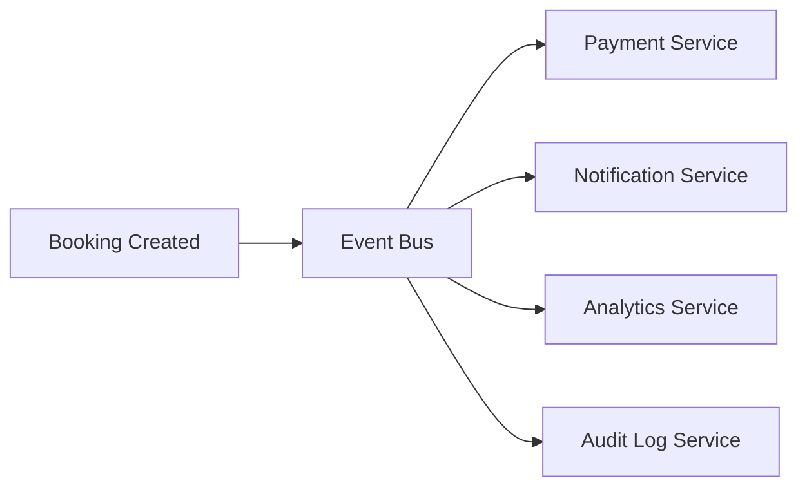
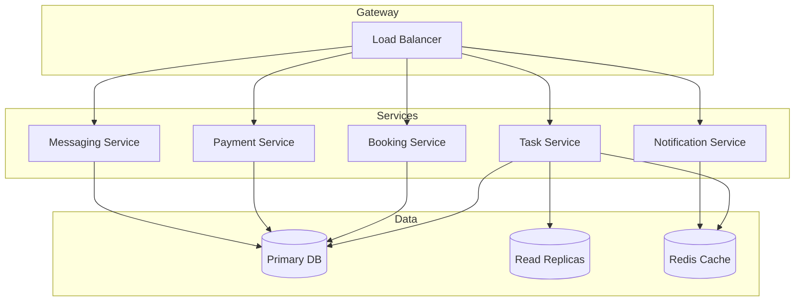

# Labor Marketplace System Design - Comprehensive Audit Report

**Audit Date:** February 23, 2026  
**Auditor Role:** Senior Solutions Architect  
**Document Reviewed:** Labor_Marketplace_System_Design.pdf  
**Codebase:** LaborMVC (ASP.NET Core MVC)

---

## Executive Summary

This audit reveals significant gaps between the system design document and a production-ready labor marketplace platform. While the design document covers core functionality adequately, it lacks critical enterprise-grade features required for a secure, scalable, and legally compliant two-sided marketplace. The current implementation shows partial coverage of the design specifications.

---

## 1. Missing Functional Requirements

### 1.1 Critical Missing Features

#### 1.1.1 Notification System
**Gap:** No comprehensive notification architecture defined.

| Missing Component | Impact | Severity |
|------------------|--------|----------|
| Email notifications | Users unaware of task updates, applications, payments | High |
| SMS notifications | Missed urgent task alerts | Medium |
| Push notifications | Poor mobile user engagement | Medium |
| In-app notification center | No centralized alert management | High |

**Required Notifications:**
- Task application received (for poster)
- Application accepted/rejected (for worker)
- Booking confirmed/reminder (both parties)
- Payment held/released/refunded
- Dispute opened/resolved
- New message received
- Rating received
- Task starting soon reminder

#### 1.1.2 Worker Availability Management
**Gap:** Document mentions "Worker availability calendar" as optional but this is essential for preventing scheduling conflicts.

**Missing Features:**
- Worker availability calendar (block out dates/times)
- Recurring availability patterns (e.g., available Mon-Fri 9-5)
- Real-time availability status
- Vacation/do-not-disturb mode
- Maximum concurrent tasks limit

#### 1.1.3 Task Bidding System
**Gap:** Current design only allows single proposed rate per application.

**Missing Features:**
- Counter-offer functionality (negotiation flow)
- Bid history tracking
- Automatic bid expiration
- Bulk bidding for similar tasks

#### 1.1.4 Insurance & Liability
**Gap:** Mentioned as optional but critical for high-risk tasks.

**Missing Components:**
- Insurance provider integration
- Liability waiver acceptance workflow
- Insurance certificate storage
- Claim filing process
- Coverage verification for high-value tasks

#### 1.1.5 Tax & Compliance
**Gap:** Completely absent from design.

**Missing Features:**
- Tax form generation (1099-K for US workers)
- Tax withholding for applicable jurisdictions
- VAT/GST handling for international operations
- Labor law compliance checks (worker classification)
- Earnings reporting dashboard

#### 1.1.6 Dispute Evidence System
**Gap:** Design mentions "both upload evidence" but lacks detail.

**Missing Components:**
- Structured evidence upload (photos, videos, documents)
- Evidence metadata (timestamp, GPS location)
- Evidence chain of custody
- Third-party arbitration integration
- Dispute history/precedent system

### 1.2 Platform Management Features

#### 1.2.1 Admin Dashboard Gaps
**Current:** Basic dispute resolution mentioned  
**Missing:**

| Feature | Purpose |
|---------|---------|
| Platform analytics | Revenue, user growth, task completion rates |
| User management | Account suspension, verification approval, role management |
| Content moderation | Task description review, message monitoring |
| Financial reporting | Payment reconciliation, fee tracking, payout management |
| Audit logs | All admin actions tracked |
| System health monitoring | Error rates, performance metrics |

#### 1.2.2 Platform Fee Management
**Gap:** Design mentions `application_fee_amount` but lacks fee configuration.

**Missing:**
- Configurable platform fee percentages
- Tiered fee structures (premium workers pay lower fees)
- Fee waivers and promotions
- Fee split calculations for multi-worker tasks
- Invoice generation for platform fees

### 1.3 User Experience Features

#### 1.3.1 Search & Discovery Gaps
**Current:** Basic search with ranking algorithm  
**Missing:**

- Saved searches with alerts
- Task recommendations based on worker skills/history
- Poster's hiring history and preferences
- "Similar tasks" suggestions
- Advanced filters (verified only, rating threshold, response time)
- Search result pagination strategy not defined

#### 1.3.2 User Profile Gaps
**Missing:**

- Portfolio/work history showcase
- Skill certifications and badges
- Response time metrics
- Completion rate statistics
- Preferred work areas (geographic)
- Language preferences

---

## 2. Architectural Flaws

### 2.1 Database Design Issues

#### 2.1.1 Missing Entities

```mermaid
erDiagram
    MISSING_ENTITIES {
        Notification User_Task
        WorkerAvailability
        TaskBidHistory
        InsurancePolicy
        TaxDocument
        AuditLog
        PlatformFee
        SavedSearch
        UserPortfolio
        Certification
    }
```

#### 2.1.2 Schema Issues in Current Design

| Issue | Description | Recommendation |
|-------|-------------|----------------|
| No soft delete on Tasks | Hard deletes lose audit trail | Add `IsDeleted` flag |
| Missing `Reviews` table in implementation | Rating entity exists but Reviews not fully implemented | Complete implementation |
| No `TaskAttachments` table | Files stored as JSON array | Normalize for querying |
| No `BookingHistory` table | No audit trail for booking changes | Add for compliance |
| Missing `PaymentEvents` table | No payment event log | Critical for reconciliation |

#### 2.1.3 Indexing Strategy Not Defined

**Critical Missing Indexes:**
```sql
-- Task search optimization
CREATE INDEX IX_Tasks_Status_Category ON Tasks(Status, Category);
CREATE INDEX IX_Tasks_Location ON Tasks(Latitude, Longitude);
CREATE INDEX IX_Tasks_CreatedAt ON Tasks(CreatedAt DESC);

-- Booking overlap queries
CREATE INDEX IX_Bookings_Worker_Time ON Bookings(WorkerId, StartTime, EndTime);

-- Application queries
CREATE INDEX IX_Applications_Status ON TaskApplications(Status);
CREATE INDEX IX_Applications_Worker_Task ON TaskApplications(WorkerId, TaskItemId);
```

### 2.2 API Design Gaps

#### 2.2.1 Missing API Versioning
**Issue:** No versioning strategy defined.  
**Impact:** Breaking changes will affect all clients.  
**Recommendation:** Implement URL versioning (`/api/v1/tasks`) or header versioning.

#### 2.2.2 Missing Rate Limiting
**Issue:** No rate limiting mentioned.  
**Impact:** Vulnerable to abuse, DoS attacks.  
**Recommendation:** Implement per-user and per-IP rate limits.

#### 2.2.3 Missing Idempotency Keys
**Issue:** Only mentioned for Stripe, not for all POST operations.  
**Impact:** Duplicate operations on network retries.  
**Recommendation:** Require `Idempotency-Key` header for all mutating operations.

### 2.3 Service Layer Issues

#### 2.3.1 Missing Domain Events
**Current:** Direct service-to-service calls.  
**Problem:** Tight coupling, no audit trail.

**Recommended Event-Driven Architecture:**


#### 2.3.2 Missing Saga Pattern for Distributed Transactions
**Issue:** Booking creation involves multiple services (booking, payment, notification).  
**Risk:** Partial failures leave system in inconsistent state.

**Recommendation:** Implement saga pattern with compensation actions:
1. Create Booking (Pending)
2. Hold Payment
3. Confirm Booking
4. Send Notification
5. On any failure: Execute compensation in reverse order

### 2.4 Caching Strategy Not Defined

**Missing Cache Policies:**

| Data Type | Cache Duration | Invalidation Strategy |
|-----------|---------------|----------------------|
| User profiles | 15 minutes | On profile update |
| Task listings | 1 minute | On task create/update/delete |
| Worker availability | 30 seconds | On availability change |
| Search results | 5 minutes | Time-based expiry |
| Static data (categories) | 24 hours | Manual invalidation |

---

## 3. Security Vulnerabilities

### 3.1 Authentication & Authorization Gaps

#### 3.1.1 Missing Multi-Factor Authentication
**Risk Level:** HIGH  
**Issue:** Only email/password authentication mentioned.

**Recommendations:**
- SMS OTP for high-value transactions
- TOTP (Google Authenticator) for account security
- Mandatory MFA for workers handling tasks > $500

#### 3.1.2 Missing Session Management
**Issues:**
- No session timeout policy defined
- No concurrent session limits
- No session revocation mechanism

**Recommendations:**
- JWT with short expiry (15 min) + refresh tokens
- Token blacklisting for logout
- Device fingerprinting for suspicious login detection

#### 3.1.3 Missing Role-Based Access Control Details
**Current:** `ClientRole` enum exists but lacks granular permissions.

**Recommended Permission Structure:**
```
Admin
├── UserManagement
│   ├── ViewUsers
│   ├── SuspendUsers
│   └── VerifyUsers
├── DisputeManagement
│   ├── ViewDisputes
│   └── ResolveDisputes
└── PlatformManagement
    ├── ConfigureFees
    └── GenerateReports

Worker
├── TaskOperations
│   ├── ViewOpenTasks
│   ├── ApplyToTasks
│   └── CompleteTasks
└── ProfileManagement
    ├── UpdateProfile
    └── SetAvailability

Poster
├── TaskOperations
│   ├── CreateTasks
│   ├── EditOwnTasks
│   └── CancelOwnTasks
└── BookingOperations
    ├── AcceptWorkers
    └── RateWorkers
```

### 3.2 Data Security Issues

#### 3.2.1 PII Protection Not Addressed
**Missing:**
- Data encryption at rest policy
- PII field-level encryption
- Data retention policies
- Right to erasure (GDPR) implementation
- Data export functionality

#### 3.2.2 ID Document Storage
**Issue:** Design mentions "stored securely" without specifics.

**Requirements:**
- AES-256 encryption for stored documents
- Separate storage bucket with restricted access
- Document access logging
- Automatic expiration and deletion
- Secure upload with virus scanning

#### 3.2.3 Message Content Security
**Issue:** Messages stored in plain text.

**Risks:**
- Sensitive data exposure in database breach
- No content moderation capability
- Legal compliance issues

**Recommendations:**
- End-to-end encryption for sensitive communications
- Content scanning for PII/malicious content
- Message retention and deletion policies

### 3.3 API Security Gaps

#### 3.3.1 Missing Input Validation Specifications
**Issues:**
- No maximum field lengths defined
- No input sanitization rules
- No file upload validation rules

**Required Validations:**
```csharp
// Example validation rules needed
public class TaskCreateValidator
{
    // Title: Max 200 chars, no HTML
    // Description: Max 5000 chars, sanitized HTML allowed
    // Budget: Min $5, Max $10,000
    // Location: Valid coordinates within service area
    // Attachments: Max 5 files, 10MB each, allowed types only
}
```

#### 3.3.2 Missing CORS Policy Definition
**Issue:** No CORS configuration specified.  
**Risk:** Cross-origin attacks, credential theft.

#### 3.3.3 Missing Security Headers
**Required Headers:**
```
Strict-Transport-Security: max-age=31536000; includeSubDomains
X-Content-Type-Options: nosniff
X-Frame-Options: DENY
Content-Security-Policy: default-src 'self'
X-XSS-Protection: 1; mode=block
```

### 3.4 Payment Security Gaps

#### 3.4.1 Missing Fraud Detection
**Issues:**
- No velocity checks (multiple bookings in short time)
- No anomaly detection for unusual patterns
- No device fingerprinting

**Recommendations:**
- Implement Stripe Radar or custom fraud rules
- Flag accounts with multiple failed payments
- Monitor for collusion patterns (same IP, device)

#### 3.4.2 Missing Payment Reconciliation
**Issue:** No daily reconciliation process defined.

**Required:**
- Automated daily Stripe balance reconciliation
- Alert on discrepancies
- Manual review queue for flagged transactions

---

## 4. Scalability Bottlenecks

### 4.1 Database Scalability

#### 4.1.1 Missing Read Replica Strategy
**Issue:** All reads go to primary database.  
**Impact:** Read contention under load.

**Recommendation:**
```
Primary DB (Write) → Read Replica 1 (Task queries)
                    → Read Replica 2 (User queries)
                    → Read Replica 3 (Analytics)
```

#### 4.1.2 Missing Partitioning Strategy
**Issue:** Single-table design will not scale.

**Recommended Partitioning:**
- `Tasks` table: Partition by `CreatedAt` (monthly)
- `Bookings` table: Partition by `StartTime` (monthly)
- `Messages` table: Partition by `CreatedAt` (monthly)
- `Payments` table: Partition by `CreatedAt` (monthly)

#### 4.1.3 Missing Connection Pooling Configuration
**Issue:** No connection pool settings defined.

**Recommended Settings:**
```json
{
  "ConnectionStrings": {
    "MaxPoolSize": 200,
    "MinPoolSize": 10,
    "ConnectionTimeout": 30,
    "ConnectionLifetime": 300
  }
}
```

### 4.2 Application Scalability

#### 4.2.1 Missing Horizontal Scaling Strategy
**Current:** Monolithic MVC application.  
**Limitation:** Cannot scale individual components.

**Recommended Evolution:**


#### 4.2.2 Missing Background Job Scaling
**Issue:** Hangfire mentioned but no scaling strategy.

**Recommendations:**
- Separate Hangfire servers for different job types
- Priority queues for urgent jobs
- Job batching for bulk operations
- Dead letter queue for failed jobs

### 4.3 Real-Time Communication Scalability

#### 4.3.1 SignalR Scaling Not Addressed
**Issue:** SignalR with in-memory backplane won't scale.

**Required for Multi-Instance:**
```csharp
// Redis backplane configuration
services.AddSignalR()
    .AddStackExchangeRedis(connectionString, options =>
    {
        options.Configuration.ChannelPrefix = "LaborMarketplace:";
    });
```

#### 4.3.2 Missing Connection Management
**Issues:**
- No connection limit per user
- No reconnection strategy defined
- No offline message queuing

### 4.4 Search Scalability

#### 4.4.1 SQL Server Full-Text Search Limitations
**Issues:**
- Not designed for high-volume search
- Limited ranking capabilities
- No typo tolerance
- No faceted search

**Recommendation:** Migrate to Elasticsearch for:
- Full-text search with typo tolerance
- Geospatial queries
- Faceted navigation
- Search analytics
- Auto-complete suggestions

### 4.5 File Storage Scalability

#### 4.5.1 Missing File Storage Strategy
**Issue:** No strategy for task attachments, profile pictures, ID documents.

**Recommendations:**
- Azure Blob Storage with CDN
- Separate containers by type (attachments, profiles, documents)
- Lifecycle policies for automatic cleanup
- CDN for profile pictures and public attachments

---

## 5. Implementation Gaps vs Design Document

### 5.1 Current Implementation Status

| Feature | Design Status | Implementation Status | Gap |
|---------|--------------|----------------------|-----|
| User Registration | Defined | Implemented | Complete |
| Task CRUD | Defined | Implemented | Complete |
| Task Applications | Defined | Implemented | Partial (no counter-offer) |
| Bookings | Defined | Implemented | Partial (no status workflow) |
| Payments (Escrow) | Defined | Partial | Missing webhook handling |
| Ratings | Defined | Partial | Missing visibility rules |
| Disputes | Defined | Implemented | Missing evidence system |
| Messaging | Defined | Partial | Missing read receipts |
| Verification | Defined | Partial | Missing workflow |
| Search | Defined | Partial | Missing spatial index |
| Admin Dashboard | Mentioned | Partial | Missing analytics |

### 5.2 Entity Comparison

| Design Entity | Implementation | Differences |
|--------------|----------------|-------------|
| Users | `AppUser` | Has `HasVisa` instead of payment verification |
| Tasks | `TaskItem` | Missing `geography` type, using decimal lat/lng |
| TaskApplications | `TaskApplication` | Missing `ProposedRate` (has `ProposedBudget`) |
| Bookings | `Booking` | Has `RowVersion` for concurrency (good) |
| Payments | `Payment` | Missing `Status` enum values |
| Messages | `Message` | Implemented |
| Reviews | `Rating` | Renamed, missing visibility logic |
| Disputes | `Dispute` | Has additional `ResolutionType` |

---

## 6. Recommendations Summary

### 6.1 Critical Priority (Must Address Before Launch)

1. **Security**
   - Implement MFA for high-value transactions
   - Add comprehensive input validation
   - Implement rate limiting
   - Add security headers middleware
   - Complete payment webhook handling

2. **Compliance**
   - Implement data encryption at rest
   - Add GDPR compliance features
   - Create tax document generation
   - Implement audit logging

3. **Core Features**
   - Complete notification system
   - Implement worker availability calendar
   - Add evidence system for disputes
   - Complete rating visibility logic

### 6.2 High Priority (Address Within 3 Months)

1. **Scalability**
   - Configure Redis backplane for SignalR
   - Implement caching strategy
   - Add database indexes
   - Configure connection pooling

2. **Platform Management**
   - Build comprehensive admin dashboard
   - Implement platform fee configuration
   - Add analytics and reporting

3. **User Experience**
   - Add saved searches
   - Implement task recommendations
   - Add user portfolio feature

### 6.3 Medium Priority (Address Within 6 Months)

1. **Architecture Evolution**
   - Plan microservices migration
   - Implement event-driven architecture
   - Add read replicas

2. **Advanced Features**
   - Insurance integration
   - Background check integration
   - Elasticsearch migration for search

---

## 7. Conclusion

The Labor Marketplace System Design document provides a solid foundation but requires significant enhancement to meet enterprise-grade requirements. The current implementation covers approximately 60-70% of the design specifications, with notable gaps in security, notifications, and scalability.

**Key Takeaways:**
- **Security** is the most critical gap requiring immediate attention
- **Scalability** architecture must be defined before production launch
- **Compliance** features are completely absent and legally required
- **Platform management** features are insufficient for operations

The platform has potential but should not launch without addressing the critical priority items outlined in this report.

---

**Report Prepared By:** Senior Solutions Architect  
**Review Status:** Complete  
**Next Steps:** Prioritize and schedule remediation work