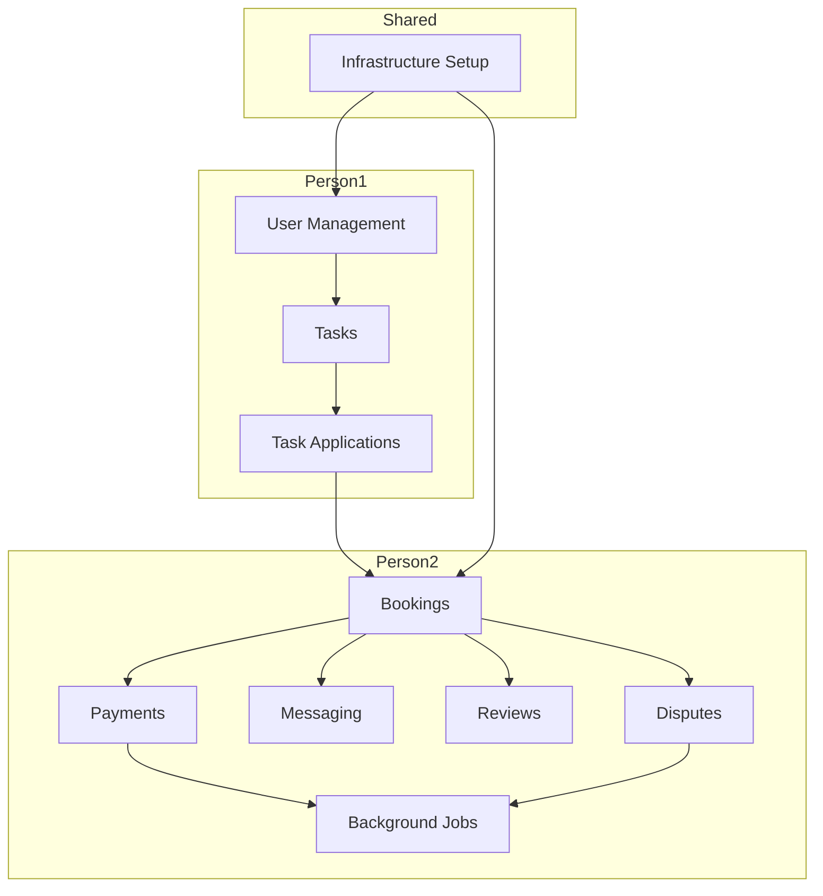

# Labor Marketplace System - Task Breakdown

## Project Overview

**Project Name:** Labor Marketplace System  
**Technology Stack:** ASP.NET MVC 5, Entity Framework, SQL Server, SignalR, Stripe, Hangfire  
**Architecture:** N-Tier (Presentation Layer, Controllers Layer, Business Logic Layer, Data Access Layer)

---

## Task Distribution Summary

| Person | Assigned Modules |
|--------|------------------|
| **Person 1** | User Management, Tasks, Applications |
| **Person 2** | Bookings, Payments, Messaging, Reviews |

---

# Person 1 Tasks

## Module 1: User Management

### 1.1 Database Layer Tasks

- [ ] **T1.1.1** Create extended User entity inheriting from AspNetUsers
  - Add FirstName, LastName, PhoneNumber, PhoneConfirmed properties
  - Add IDVerified, AverageRating, Location, Country properties
  - Add CreatedAt timestamp
  - Implement UserTypeEnum (Admin, Client) with Client having Worker/Poster roles

- [ ] **T1.1.2** Create ApplicationUser DbContext configuration
  - Configure entity mappings
  - Set up relationships with other entities

- [ ] **T1.1.3** Create UserRepository
  - Implement generic repository pattern
  - Add specific methods: GetUserByIdAsync, GetUserByEmailAsync, UpdateUserRatingAsync
  - Implement verification status update methods

### 1.2 Business Logic Layer Tasks

- [ ] **T1.2.1** Create UserService
  - Implement user registration with role assignment
  - Implement profile update functionality
  - Implement rating calculation logic

- [ ] **T1.2.2** Create VerificationService
  - Implement email verification workflow
  - Implement phone verification workflow
  - Implement ID document upload and verification logic
  - Implement verification tier checking (unverified users limited to $100 tasks)

- [ ] **T1.2.3** Create UserViewModel classes
  - RegisterViewModel, LoginViewModel, ProfileViewModel
  - UserDashboardViewModel with role-specific data

### 1.3 Presentation Layer Tasks

- [ ] **T1.3.1** Create AccountController
  - Implement Register action (GET/POST)
  - Implement Login action (GET/POST)
  - Implement Logout action
  - Implement Profile management actions
  - Add role-based authorization attributes

- [ ] **T1.3.2** Create Authentication Views
  - Login.cshtml - login form with validation
  - Register.cshtml - registration form with role selection
  - Profile.cshtml - user profile management

- [ ] **T1.3.3** Implement role-based navigation
  - Create partial views for role-specific menu items
  - Implement role-based UI rendering

---

## Module 2: Tasks

### 2.1 Database Layer Tasks

- [ ] **T2.1.1** Create Task entity
  - Id (int, PK), PosterId (string, FK)
  - Category (enum: Cleaning, Moving, Repair, Gardening, etc.)
  - Title, Description, Address
  - Location (geography - SQL Server spatial type)
  - ScheduledStart, ScheduledEnd
  - BudgetType (enum: Fixed, Hourly), BudgetAmount
  - Status (enum: Open, Assigned, InProgress, Completed, Cancelled, Disputed)
  - CreatedAt, UpdatedAt timestamps

- [ ] **T2.1.2** Create TaskCategory enum
  - Define all task categories as per requirements

- [ ] **T2.1.3** Create TaskRepository
  - Implement CRUD operations
  - Implement spatial query methods for location-based search
  - Implement filtering methods (by category, status, date range, budget)

- [ ] **T2.1.4** Create spatial index on Tasks table
  - Execute: CREATE SPATIAL INDEX SIndx_Tasks_Location ON Tasks(Location)

### 2.2 Business Logic Layer Tasks

- [ ] **T2.2.1** Create TaskService
  - Implement task creation with validation
  - Implement task update with status management
  - Implement task deletion with business rule checks
  - Implement surge pricing calculation (1.5x for urgent tasks within 2 hours)

- [ ] **T2.2.2** Create SearchService
  - Implement location-based search with radius filtering
  - Implement search ranking algorithm:
    - Distance: 40% weight
    - Poster rating: 20% weight
    - Task urgency: 20% weight
    - Budget: 20% weight
  - Implement result caching for performance

- [ ] **T2.2.3** Create TaskViewModel classes
  - TaskCreateViewModel, TaskEditViewModel
  - TaskListViewModel, TaskDetailViewModel
  - TaskSearchViewModel with filters

### 2.3 Presentation Layer Tasks

- [ ] **T2.3.1** Create TaskController
  - Implement Index action with pagination
  - Implement Create action (GET/POST) with map integration
  - Implement Edit action (GET/POST)
  - Implement Detail action
  - Implement Delete action (POST)
  - Implement Search action with filters
  - Add [Authorize(Roles = "Poster")] for create/edit

- [ ] **T2.3.2** Create Task Views
  - Index.cshtml - task list with cards and filters
  - Create.cshtml - task creation form with Leaflet.js map
  - Edit.cshtml - task editing form
  - Details.cshtml - full task details with apply button
  - _TaskCard.cshtml - partial view for task card display

- [ ] **T2.3.3** Implement map integration
  - Integrate Leaflet.js for location selection
  - Implement address autocomplete
  - Display task locations on map

---

## Module 3: Task Applications

### 3.1 Database Layer Tasks

- [ ] **T3.1.1** Create TaskApplication entity
  - Id (int, PK), TaskId (int, FK), WorkerId (string, FK)
  - ProposedRate (decimal), Message (nvarchar(max))
  - Status (enum: Pending, Accepted, Rejected)
  - CreatedAt timestamp

- [ ] **T3.1.2** Create TaskApplicationRepository
  - Implement CRUD operations
  - Implement GetApplicationsByTaskIdAsync
  - Implement GetApplicationsByWorkerIdAsync
  - Implement GetPendingApplicationsAsync

### 3.2 Business Logic Layer Tasks

- [ ] **T3.2.1** Create ApplicationService
  - Implement application submission with verification tier check
  - Implement application acceptance logic
  - Implement application rejection logic
  - Implement poster invitation to specific workers

- [ ] **T3.2.2** Create ApplicationViewModel classes
  - ApplicationCreateViewModel
  - ApplicationListViewModel
  - ApplicationDetailViewModel

### 3.3 Presentation Layer Tasks

- [ ] **T3.3.1** Create ApplicationController
  - Implement Apply action (GET/POST)
  - Implement Accept action (POST)
  - Implement Reject action (POST)
  - Implement ListByTask action
  - Implement ListByWorker action
  - Add [Authorize(Roles = "Worker")] for apply action

- [ ] **T3.3.2** Create Application Views
  - Apply.cshtml - application form with rate proposal
  - _ApplicationList.cshtml - partial view for application list
  - _ApplicationCard.cshtml - partial view for application display

---

# Person 2 Tasks

## Module 4: Bookings

### 4.1 Database Layer Tasks

- [ ] **T4.1.1** Create Booking entity
  - Id (int, PK), TaskId (int, FK), WorkerId (string, FK)
  - AgreedRate (decimal)
  - StartTime, EndTime (nullable for actual times)
  - Status (enum: Scheduled, InProgress, Completed, Cancelled, Disputed)
  - Version (rowversion) - concurrency token  
  - CreatedAt timestamp

- [ ] **T4.1.2** Create BookingRepository
  - Implement CRUD operations
  - Implement GetBookingsByWorkerIdAsync
  - Implement GetBookingsByPosterIdAsync
  - Implement GetOverlappingBookingsAsync for concurrency check

### 4.2 Business Logic Layer Tasks

- [ ] **T4.2.1** Create BookingService
  - Implement booking creation with concurrency check
  - Implement double-booking prevention:
    - Use serializable transactions
    - Check: (Start < new.End) AND (End > new.Start)
    - Use optimistic concurrency with rowversion
  - Implement booking status transitions
  - Implement GPS check-in/out for hourly tasks

- [ ] **T4.2.2** Create CancellationService
  - Implement cancellation logic with penalty rules:
    - Client cancels < 2 hours: forfeit 50% to worker
    - Worker no-show: rating penalty, account suspension
  - Implement no-show detection (auto-flag after start + 30 min)

- [ ] **T4.2.3** Create BookingViewModel classes
  - BookingCreateViewModel
  - BookingListViewModel
  - BookingDetailViewModel
  - BookingDashboardViewModel

### 4.3 Presentation Layer Tasks

- [ ] **T4.3.1** Create BookingController
  - Implement Create action (POST) - triggered on application acceptance
  - Implement Start action (POST) - worker marks as started
  - Implement Complete action (POST) - both parties confirm
  - Implement Cancel action (POST) - with penalty calculation
  - Implement Dashboard action - list user bookings
  - Implement Detail action

- [ ] **T4.3.2** Create Booking Views
  - Dashboard.cshtml - booking dashboard with upcoming/past tabs
  - Details.cshtml - booking details with status timeline
  - _BookingCard.cshtml - partial view for booking display

---

## Module 5: Payments

### 5.1 Database Layer Tasks

- [ ] **T5.1.1** Create Payment entity
  - Id (int, PK), BookingId (int, FK)
  - Amount (decimal)
  - Status (enum: Held, Released, Refunded, PartiallyRefunded)
  - StripePaymentIntentId (string)
  - CreatedAt, ReleasedAt timestamps

- [ ] **T5.1.2** Create PaymentRepository
  - Implement CRUD operations
  - Implement GetPaymentByBookingIdAsync
  - Implement UpdatePaymentStatusAsync

### 5.2 Business Logic Layer Tasks

- [ ] **T5.2.1** Create PaymentService
  - Implement escrow funding with Stripe Connect
  - Create PaymentIntent with capture_method: manual
  - Implement payment capture/release after completion
  - Implement refund logic for cancellations
  - Handle Stripe webhooks for payment failures
  - Use idempotency keys for retry safety

- [ ] **T5.2.2** Create EscrowService
  - Implement escrow hold before work starts
  - Implement release conditions:
    - Both parties mark completed, OR
    - Dispute resolution concludes
  - Implement partial refund calculations

- [ ] **T5.2.3** Create PaymentViewModel classes
  - PaymentCreateViewModel
  - PaymentStatusViewModel
  - CheckoutViewModel

### 5.3 Presentation Layer Tasks

- [ ] **T5.3.1** Create PaymentController
  - Implement Checkout action (GET/POST)
  - Implement Webhook action for Stripe callbacks
  - Implement PaymentStatus action
  - Implement Refund action (admin only)

- [ ] **T5.3.2** Create Payment Views
  - Checkout.cshtml - Stripe Elements payment form
  - Status.cshtml - payment status display
  - _PaymentSummary.cshtml - partial view for payment info

- [ ] **T5.3.3** Integrate Stripe.js
  - Include Stripe Elements library
  - Implement secure card element
  - Handle payment confirmation

---

## Module 6: Messaging

### 6.1 Database Layer Tasks

- [ ] **T6.1.1** Create Message entity
  - Id (int, PK), BookingId (int, FK)
  - SenderId (string, FK)
  - Content (nvarchar(max))
  - SentAt timestamp
  - IsRead (bool)

- [ ] **T6.1.2** Create MessageRepository
  - Implement CRUD operations
  - Implement GetMessagesByBookingIdAsync
  - Implement MarkAsReadAsync
  - Implement GetUnreadCountAsync

### 6.2 Business Logic Layer Tasks

- [ ] **T6.2.1** Create MessageService
  - Implement message sending
  - Implement message retrieval with pagination
  - Implement unread count tracking

- [ ] **T6.2.2** Create ChatHub (SignalR)
  - Implement connection management
  - Implement booking-specific groups (booking-{bookingId})
  - Implement message broadcasting
  - Implement unread notification push

- [ ] **T6.2.3** Create MessageViewModel classes
  - MessageSendViewModel
  - MessageListViewModel
  - ChatViewModel

### 6.3 Presentation Layer Tasks

- [ ] **T6.3.1** Create MessageController
  - Implement Send action (POST)
  - Implement List action (GET) - messages by booking
  - Implement MarkAsRead action (POST)

- [ ] **T6.3.2** Create Message Views
  - _ChatBox.cshtml - partial view for chat interface
  - _MessageList.cshtml - partial view for message list
  - _MessageItem.cshtml - partial view for single message

- [ ] **T6.3.3** Implement SignalR client
  - Include SignalR JavaScript library
  - Implement connection setup
  - Implement message sending/receiving
  - Implement unread count display

---

## Module 7: Reviews & Ratings

### 7.1 Database Layer Tasks

- [ ] **T7.1.1** Create Review entity
  - Id (int, PK), BookingId (int, FK - unique)
  - ReviewerId, RevieweeId (string, FK)
  - Rating (int, 1-5)
  - Comment (nvarchar(500))
  - CreatedAt timestamp

- [ ] **T7.1.2** Create ReviewRepository
  - Implement CRUD operations
  - Implement GetReviewsByUserIdAsync
  - Implement CheckUserHasReviewedAsync

### 7.2 Business Logic Layer Tasks

- [ ] **T7.2.1** Create ReviewService
  - Implement review submission
  - Implement rating visibility logic:
    - Visible only after both parties rate OR 14 days pass
  - Implement average rating calculation
  - Implement rate limiting to prevent fake ratings

- [ ] **T7.2.2** Create ReviewViewModel classes
  - ReviewCreateViewModel
  - ReviewListViewModel
  - ReviewDetailViewModel

### 7.3 Presentation Layer Tasks

- [ ] **T7.3.1** Create ReviewController
  - Implement Create action (GET/POST)
  - Implement ListByUser action
  - Implement Detail action

- [ ] **T7.3.2** Create Review Views
  - Create.cshtml - review form with rating stars
  - _ReviewList.cshtml - partial view for review list
  - _ReviewCard.cshtml - partial view for review display
  - _StarRating.cshtml - partial view for star rating display

---

## Module 8: Disputes (Person 2 - Additional)

### 8.1 Database Layer Tasks

- [ ] **T8.1.1** Create Dispute entity
  - Id (int, PK), BookingId (int, FK)
  - RaisedBy (string, FK)
  - Reason (nvarchar(max))
  - Status (enum: Open, UnderReview, Resolved)
  - Resolution (nvarchar(max))
  - CreatedAt, ResolvedAt timestamps

- [ ] **T8.1.2** Create DisputeRepository
  - Implement CRUD operations
  - Implement GetOpenDisputesAsync
  - Implement GetDisputesByBookingIdAsync

### 8.2 Business Logic Layer Tasks

- [ ] **T8.2.1** Create DisputeService
  - Implement dispute raising (within 48h of completion)
  - Implement state machine for status transitions
  - Implement evidence upload functionality
  - Implement auto-escalation after 7 days (50/50 split or arbitration)

- [ ] **T8.2.2** Create DisputeViewModel classes
  - DisputeCreateViewModel
  - DisputeDetailViewModel
  - DisputeListViewModel

### 8.3 Presentation Layer Tasks

- [ ] **T8.3.1** Create DisputeController
  - Implement Create action (GET/POST)
  - Implement Detail action
  - Implement Resolve action (admin only)

- [ ] **T8.3.2** Create Dispute Views
  - Create.cshtml - dispute form with evidence upload
  - Details.cshtml - dispute details with timeline
  - _DisputeList.cshtml - partial view for dispute list

---

## Module 9: Background Jobs (Person 2)

### 9.1 Hangfire Setup Tasks

- [ ] **T9.1.1** Configure Hangfire
  - Install Hangfire NuGet packages
  - Configure Hangfire dashboard
  - Set up job storage (SQL Server)

- [ ] **T9.1.2** Create Recurring Jobs
  - Task reminder job (every hour)
  - No-show detection job (every 15 minutes)
  - Dispute escalation job (daily)

- [ ] **T9.1.3** Create Fire-and-Forget Jobs
  - Auto-release payment after 24h if no dispute
  - Send notification emails

---

## Module 10: Admin Area (Person 2)

### 10.1 Admin Dashboard Tasks

- [ ] **T10.1.1** Create Admin Area
  - Configure ASP.NET MVC Area
  - Set up admin authorization

- [ ] **T10.1.2** Create AdminController
  - Implement Dashboard action with platform statistics
  - Implement UserManagement actions
  - Implement DisputeResolution actions

- [ ] **T10.1.3** Create Admin Views
  - Dashboard.cshtml - platform overview
  - UserList.cshtml - user management
  - DisputeList.cshtml - dispute resolution interface

---

# Shared Infrastructure Tasks

## Both Persons - Coordinated Tasks

### Infrastructure Setup
- [ ] **Shared-1** Set up project structure (LaborDAL, LaborBLL, LaborPL)
- [ ] **Shared-2** Configure Entity Framework DbContext
- [ ] **Shared-3** Configure Dependency Injection container
- [ ] **Shared-4** Set up ASP.NET Identity with roles
- [ ] **Shared-5** Configure global error handling
- [ ] **Shared-6** Set up logging infrastructure

### Shared Components
- [ ] **Shared-7** Create base ViewModel classes
- [ ] **Shared-8** Create common partial views (_Layout, navigation)
- [ ] **Shared-9** Implement Bootstrap 5 responsive layout
- [ ] **Shared-10** Configure client-side validation (jQuery Validation)

---

# Task Dependencies Diagram

---

# Estimated Task Summary

| Person | Module | Task Count |
|--------|--------|------------|
| Person 1 | User Management | 12 |
| Person 1 | Tasks | 15 |
| Person 1 | Task Applications | 10 |
| **Person 1 Total** | | **37** |
| Person 2 | Bookings | 12 |
| Person 2 | Payments | 12 |
| Person 2 | Messaging | 12 |
| Person 2 | Reviews | 9 |
| Person 2 | Disputes | 9 |
| Person 2 | Background Jobs | 5 |
| Person 2 | Admin Area | 5 |
| **Person 2 Total** | | **64** |
| Shared | Infrastructure | 10 |
| **Grand Total** | | **111** |

---

# Notes

1. **Integration Points**: Person 1 and Person 2 need to coordinate on:
   - Task Application acceptance triggers Booking creation
   - Booking completion triggers Payment release
   - Booking completion enables Review submission

2. **API Contracts**: Define clear interfaces between modules before starting implementation.

3. **Database Migrations**: Coordinate EF migrations to avoid conflicts.

4. **Testing**: Each person is responsible for unit testing their modules.

---

*Document Generated: February 2026*