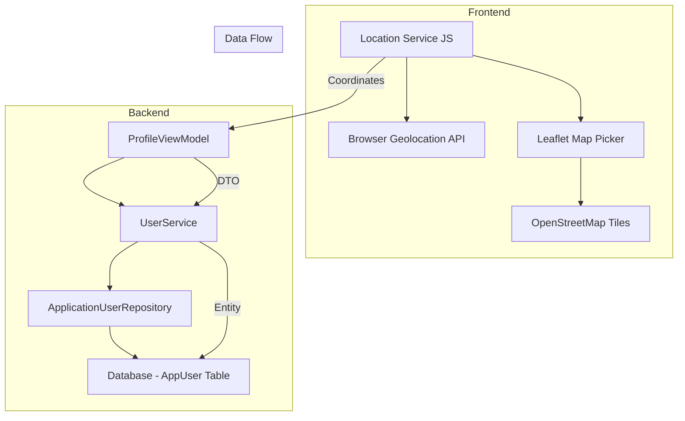
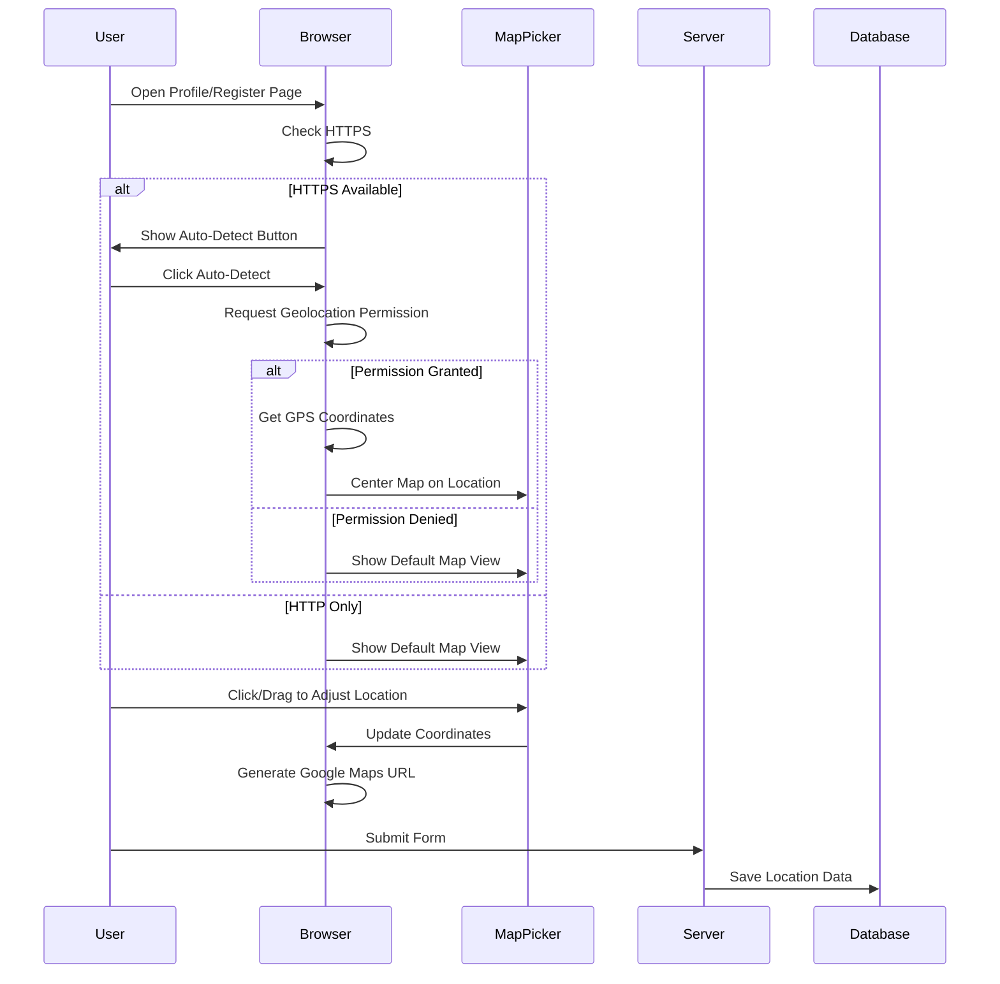

# User Location Feature - Hybrid Approach Implementation Plan

## Overview
This plan outlines the implementation of a hybrid location feature that combines browser geolocation with a map picker widget. This will allow users to automatically detect their location or manually select it on a map, storing both the coordinates and generating a map URL.

## Current State Analysis

### Existing Fields in [`AppUser`](LaborDAL/Entities/AppUser.cs:35)
- `LocationUrl` - Map link (string, nullable)
- `Location` - Address (string, nullable)
- `Country` - Country (string, nullable)

### Missing Fields
- `Latitude` - Geographic latitude (decimal)
- `Longitude` - Geographic longitude (decimal)

---

## Architecture Design

### Component Diagram



### User Flow



---

## Implementation Details

### 1. Database Changes

#### Add New Fields to [`AppUser`](LaborDAL/Entities/AppUser.cs)

```csharp
/// <summary>
/// User's geographic latitude
/// </summary>
public decimal? Latitude { get; set; }

/// <summary>
/// User's geographic longitude
/// </summary>
public decimal? Longitude { get; set; }
```

#### Migration Required
- Add `Latitude` column (decimal(10, 8), nullable)
- Add `Longitude` column (decimal(11, 8), nullable)

### 2. ViewModel Updates

#### Update [`ProfileViewModel`](LaborBLL/ModelVM/ProfileViewModel.cs)

```csharp
[Display(Name = "Location URL")]
public string? LocationUrl { get; set; }

[Display(Name = "Latitude")]
public decimal? Latitude { get; set; }

[Display(Name = "Longitude")]
public decimal? Longitude { get; set; }
```

#### Update [`RegisterViewModel`](LaborBLL/ModelVM/RegisterViewModel.cs)

```csharp
[Display(Name = "Location URL")]
public string? LocationUrl { get; set; }

[Display(Name = "Latitude")]
public decimal? Latitude { get; set; }

[Display(Name = "Longitude")]
public decimal? Longitude { get; set; }
```

### 3. Frontend Implementation

#### Create Location Service JavaScript Module

**File**: `LaborPL/wwwroot/js/locationService.js`

```javascript
// Location Service Module
const LocationService = (function() {
    
    // Check if Geolocation is available
    function isGeolocationAvailable() {
        return 'geolocation' in navigator;
    }
    
    // Get current position using Browser Geolocation API
    function getCurrentPosition() {
        return new Promise((resolve, reject) => {
            if (!isGeolocationAvailable()) {
                reject(new Error('Geolocation is not supported by this browser.'));
                return;
            }
            
            navigator.geolocation.getCurrentPosition(
                (position) => {
                    resolve({
                        latitude: position.coords.latitude,
                        longitude: position.coords.longitude,
                        accuracy: position.coords.accuracy
                    });
                },
                (error) => {
                    switch(error.code) {
                        case error.PERMISSION_DENIED:
                            reject(new Error('User denied the request for Geolocation.'));
                            break;
                        case error.POSITION_UNAVAILABLE:
                            reject(new Error('Location information is unavailable.'));
                            break;
                        case error.TIMEOUT:
                            reject(new Error('The request to get user location timed out.'));
                            break;
                        default:
                            reject(new Error('An unknown error occurred.'));
                    }
                },
                {
                    enableHighAccuracy: true,
                    timeout: 10000,
                    maximumAge: 0
                }
            );
        });
    }
    
    // Generate Google Maps URL from coordinates
    function generateGoogleMapsUrl(latitude, longitude) {
        return `https://www.google.com/maps?q=${latitude},${longitude}`;
    }
    
    // Generate Google Maps Embed URL
    function generateGoogleMapsEmbedUrl(latitude, longitude) {
        return `https://maps.google.com/maps?q=${latitude},${longitude}&output=embed`;
    }
    
    // Reverse geocoding using Nominatim (OpenStreetMap) - Free
    async function reverseGeocode(latitude, longitude) {
        try {
            const response = await fetch(
                `https://nominatim.openstreetmap.org/reverse?lat=${latitude}&lon=${longitude}&format=json`
            );
            const data = await response.json();
            return {
                address: data.display_name,
                city: data.address?.city || data.address?.town || data.address?.village,
                country: data.address?.country
            };
        } catch (error) {
            console.error('Reverse geocoding failed:', error);
            return null;
        }
    }
    
    return {
        isGeolocationAvailable,
        getCurrentPosition,
        generateGoogleMapsUrl,
        generateGoogleMapsEmbedUrl,
        reverseGeocode
    };
})();
```

#### Create Map Picker Component

**File**: `LaborPL/wwwroot/js/mapPicker.js`

```javascript
// Map Picker Component using Leaflet and OpenStreetMap (Free)
class MapPicker {
    constructor(containerId, options = {}) {
        this.containerId = containerId;
        this.options = {
            defaultLat: options.defaultLat || 30.0444,  // Cairo default
            defaultLng: options.defaultLng || 31.2357,
            defaultZoom: options.defaultZoom || 12,
            onLocationChange: options.onLocationChange || function() {}
        };
        this.map = null;
        this.marker = null;
        this.init();
    }
    
    init() {
        // Initialize Leaflet map
        this.map = L.map(this.containerId).setView(
            [this.options.defaultLat, this.options.defaultLng], 
            this.options.defaultZoom
        );
        
        // Add OpenStreetMap tiles (Free)
        L.tileLayer('https://{s}.tile.openstreetmap.org/{z}/{x}/{y}.png', {
            attribution: '© OpenStreetMap contributors'
        }).addTo(this.map);
        
        // Add click handler
        this.map.on('click', (e) => this.onMapClick(e));
        
        // Add draggable marker
        this.marker = L.marker(
            [this.options.defaultLat, this.options.defaultLng], 
            { draggable: true }
        ).addTo(this.map);
        
        this.marker.on('dragend', (e) => this.onMarkerDrag(e));
    }
    
    onMapClick(e) {
        this.marker.setLatLng(e.latlng);
        this.notifyLocationChange(e.latlng.lat, e.latlng.lng);
    }
    
    onMarkerDrag(e) {
        const position = e.target.getLatLng();
        this.notifyLocationChange(position.lat, position.lng);
    }
    
    notifyLocationChange(lat, lng) {
        this.options.onLocationChange({
            latitude: lat,
            longitude: lng,
            locationUrl: LocationService.generateGoogleMapsUrl(lat, lng)
        });
    }
    
    setLocation(lat, lng) {
        this.map.setView([lat, lng], 15);
        this.marker.setLatLng([lat, lng]);
        this.notifyLocationChange(lat, lng);
    }
    
    getLocation() {
        const position = this.marker.getLatLng();
        return {
            latitude: position.lat,
            longitude: position.lng
        };
    }
}
```

### 4. View Updates

#### Update [`Profile.cshtml`](LaborPL/Views/Account/Profile.cshtml)

Add the following elements:

```html
<!-- Location Section with Map Picker -->
<div class="row">
    <div class="col-md-6 mb-3">
        <label class="form-label">
            <i class="bi bi-geo-alt me-1"></i>Location
        </label>
        <div class="d-flex gap-2 mb-2">
            <button type="button" id="detectLocationBtn" class="btn btn-outline-primary btn-sm">
                <i class="bi bi-crosshair"></i> Auto-Detect
            </button>
            <span id="locationStatus" class="text-muted small"></span>
        </div>
        <input asp-for="Location" class="form-control" placeholder="Address or area" />
        <input type="hidden" asp-for="Latitude" id="latitudeInput" />
        <input type="hidden" asp-for="Longitude" id="longitudeInput" />
        <input type="hidden" asp-for="LocationUrl" id="locationUrlInput" />
    </div>
    <div class="col-md-6 mb-3">
        <label class="form-label">
            <i class="bi bi-map me-1"></i>Select on Map
        </label>
        <div id="mapPicker" style="height: 250px; border-radius: 8px;"></div>
    </div>
</div>

@section Scripts {
    <!-- Leaflet CSS -->
    <link rel="stylesheet" href="https://unpkg.com/leaflet@1.9.4/dist/leaflet.css" />
    <!-- Leaflet JS -->
    <script src="https://unpkg.com/leaflet@1.9.4/dist/leaflet.js"></script>
    <!-- Location Service -->
    <script src="~/js/locationService.js"></script>
    <!-- Map Picker -->
    <script src="~/js/mapPicker.js"></script>
    
    <script>
        let mapPicker;
        
        document.addEventListener('DOMContentLoaded', function() {
            // Initialize map picker
            const initialLat = @Model.Latitude?.ToString() || '30.0444';
            const initialLng = @Model.Longitude?.ToString() || '31.2357';
            
            mapPicker = new MapPicker('mapPicker', {
                defaultLat: initialLat,
                defaultLng: initialLng,
                onLocationChange: function(data) {
                    document.getElementById('latitudeInput').value = data.latitude;
                    document.getElementById('longitudeInput').value = data.longitude;
                    document.getElementById('locationUrlInput').value = data.locationUrl;
                }
            });
            
            // Auto-detect button handler
            document.getElementById('detectLocationBtn').addEventListener('click', async function() {
                const statusEl = document.getElementById('locationStatus');
                statusEl.textContent = 'Detecting...';
                
                try {
                    const position = await LocationService.getCurrentPosition();
                    mapPicker.setLocation(position.latitude, position.longitude);
                    
                    // Get address from coordinates
                    const address = await LocationService.reverseGeocode(position.latitude, position.longitude);
                    if (address) {
                        document.getElementById('Location').value = address.address;
                        document.getElementById('Country').value = address.country;
                    }
                    
                    statusEl.textContent = 'Location detected!';
                    statusEl.className = 'text-success small';
                } catch (error) {
                    statusEl.textContent = error.message;
                    statusEl.className = 'text-danger small';
                }
            });
        });
    </script>
}
```

### 5. AutoMapper Updates

Update [`AutoMapperProfile.cs`](LaborBLL/Mappper/AutoMapperProfile.cs):

```csharp
CreateMap<AppUser, ProfileViewModel>()
    .ForMember(dest => dest.Latitude, opt => opt.MapFrom(src => src.Latitude))
    .ForMember(dest => dest.Longitude, opt => opt.MapFrom(src => src.Longitude))
    .ForMember(dest => dest.LocationUrl, opt => opt.MapFrom(src => src.LocationUrl));

CreateMap<ProfileViewModel, AppUser>()
    .ForMember(dest => dest.Latitude, opt => opt.MapFrom(src => src.Latitude))
    .ForMember(dest => dest.Longitude, opt => opt.MapFrom(src => src.Longitude))
    .ForMember(dest => dest.LocationUrl, opt => opt.MapFrom(src => src.LocationUrl));
```

---

## Dependencies

### NuGet Packages
- None required (using decimal type for coordinates)

### Frontend Libraries (CDN - Free)
- **Leaflet** - Map library (free, open-source)
- **OpenStreetMap** - Map tiles (free)

```html
<!-- Add to Layout or specific views -->
<link rel="stylesheet" href="https://unpkg.com/leaflet@1.9.4/dist/leaflet.css" />
<script src="https://unpkg.com/leaflet@1.9.4/dist/leaflet.js"></script>
```

---

## Security Considerations

1. **HTTPS Required**: Browser Geolocation API only works on HTTPS
2. **User Permission**: Users must grant permission for location access
3. **Privacy**: Location data should be treated as sensitive information
4. **Optional Fields**: All location fields should remain optional

---

## Testing Checklist

- [ ] Test auto-detect location on HTTPS
- [ ] Test auto-detect denial handling
- [ ] Test map picker click selection
- [ ] Test map picker drag selection
- [ ] Test reverse geocoding
- [ ] Test form submission with location data
- [ ] Test profile update with location
- [ ] Test registration with location
- [ ] Test on mobile devices
- [ ] Test on different browsers

---

## Implementation Order

1. **Database Migration** - Add Latitude/Longitude columns
2. **Entity Update** - Add properties to AppUser
3. **ViewModel Updates** - Add fields to ProfileViewModel and RegisterViewModel
4. **AutoMapper Updates** - Map new fields
5. **JavaScript Services** - Create locationService.js and mapPicker.js
6. **View Updates** - Update Profile.cshtml and Register.cshtml
7. **Testing** - Verify all functionality works correctly

---

## Estimated Effort

| Task | Complexity |
|------|------------|
| Database changes | Low |
| Backend updates | Low |
| JavaScript services | Medium |
| View integration | Medium |
| Testing | Medium |

---

## Notes

- Using **Leaflet + OpenStreetMap** instead of Google Maps to avoid API key requirements and usage limits
- The `LocationUrl` will be a Google Maps URL for easy sharing and viewing
- Reverse geocoding uses Nominatim (OpenStreetMap) which is free but has rate limits (1 request/second)