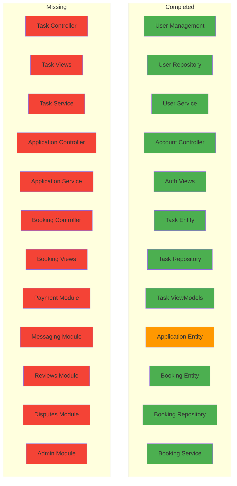
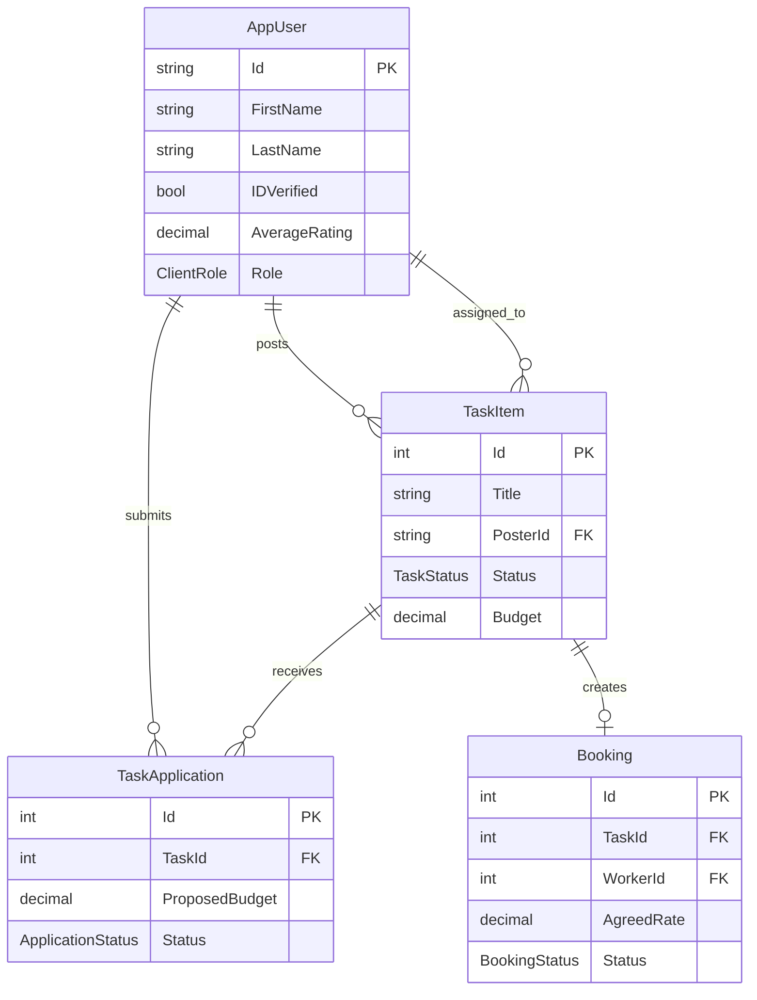

# Labor Marketplace System - Project Status Report

**Generated:** February 18, 2026  
**Based on:** `plans/Labor_Marketplace_Tasks.md`

---

## Executive Summary

| Metric | Value |
|--------|-------|
| **Total Tasks** | 111 |
| **Completed** | ~25-30 |
| **In Progress** | ~5 |
| **Not Started** | ~75-80 |
| **Overall Progress** | ~25% |

---

## Progress by Module

### Module 1: User Management (Person 1) - ~80% Complete ✅

| Task ID | Description | Status | Notes |
|---------|-------------|--------|-------|
| T1.1.1 | Create extended User entity | ✅ DONE | [`AppUser.cs`](LaborDAL/Entities/AppUser.cs) - All properties implemented |
| T1.1.2 | Create ApplicationUser DbContext configuration | ✅ DONE | [`AppUserConfiguration.cs`](LaborDAL/DB/Configuration/AppUserConfiguration.cs) |
| T1.1.3 | Create UserRepository | ✅ DONE | [`ApplicationUserRepository.cs`](LaborDAL/Repo/Implementation/ApplicationUserRepository.cs) |
| T1.2.1 | Create UserService | ✅ DONE | [`UserService.cs`](LaborBLL/Service/Implementation/UserService.cs) |
| T1.2.2 | Create VerificationService | ✅ DONE | [`VerificationService.cs`](LaborBLL/Service/Implementation/VerificationService.cs) |
| T1.2.3 | Create UserViewModel classes | ✅ DONE | LoginViewModel, RegisterViewModel, ProfileViewModel |
| T1.3.1 | Create AccountController | ✅ DONE | [`AccountController.cs`](LaborPL/Controllers/AccountController.cs) |
| T1.3.2 | Create Authentication Views | ✅ DONE | Login.cshtml, Register.cshtml, Profile.cshtml |
| T1.3.3 | Implement role-based navigation | ⬜ TODO | Partial implementation |

---

### Module 2: Tasks (Person 1) - ~50% Complete 🔄

| Task ID | Description | Status | Notes |
|---------|-------------|--------|-------|
| T2.1.1 | Create Task entity | ✅ DONE | [`TaskItem.cs`](LaborDAL/Entities/TaskItem.cs) - Full implementation |
| T2.1.2 | Create TaskCategory enum | ✅ DONE | [`TaskCategory.cs`](LaborDAL/Enums/TaskCategory.cs) - 17 categories |
| T2.1.3 | Create TaskRepository | ✅ DONE | [`TaskRepository.cs`](LaborDAL/Repo/Implementation/TaskRepository.cs) - With spatial queries |
| T2.1.4 | Create spatial index | ⬜ TODO | Not verified |
| T2.2.1 | Create TaskService | ⬜ TODO | Not created |
| T2.2.2 | Create SearchService | ⬜ TODO | Not created |
| T2.2.3 | Create TaskViewModel classes | ✅ DONE | [`TaskViewModels.cs`](LaborBLL/ModelVM/TaskViewModels.cs) |
| T2.3.1 | Create TaskController | ❌ MISSING | Only AccountController and HomeController exist |
| T2.3.2 | Create Task Views | ❌ MISSING | No task views created |
| T2.3.3 | Implement map integration | ⬜ PARTIAL | JS files exist but no controller/views |

---

### Module 3: Task Applications (Person 1) - ~30% Complete 🔄

| Task ID | Description | Status | Notes |
|---------|-------------|--------|-------|
| T3.1.1 | Create TaskApplication entity | ✅ DONE | [`TaskApplication.cs`](LaborDAL/Entities/TaskApplication.cs) |
| T3.1.2 | Create TaskApplicationRepository | ⬜ TODO | Not found |
| T3.2.1 | Create ApplicationService | ⬜ TODO | Not created |
| T3.2.2 | Create ApplicationViewModel classes | ⬜ PARTIAL | Some VMs in TaskViewModels.cs |
| T3.3.1 | Create ApplicationController | ❌ MISSING | Not created |
| T3.3.2 | Create Application Views | ❌ MISSING | Not created |

---

### Module 4: Bookings (Person 2) - ~40% Complete 🔄

| Task ID | Description | Status | Notes |
|---------|-------------|--------|-------|
| T4.1.1 | Create Booking entity | ✅ DONE | [`Booking.cs`](LaborDAL/Entities/Booking.cs) |
| T4.1.2 | Create BookingRepository | ✅ DONE | [`BookingRepo.cs`](LaborDAL/Repo/Implementation/BookingRepo.cs) |
| T4.2.1 | Create BookingService | ✅ DONE | [`BookingService.cs`](LaborBLL/Service/Implementation/BookingService.cs) |
| T4.2.2 | Create CancellationService | ⬜ TODO | Not created |
| T4.2.3 | Create BookingViewModel classes | ✅ DONE | Several VMs exist |
| T4.3.1 | Create BookingController | ❌ MISSING | Not created |
| T4.3.2 | Create Booking Views | ❌ MISSING | Not created |

---

### Module 5: Payments (Person 2) - 0% Complete ❌

| Task ID | Description | Status |
|---------|-------------|--------|
| T5.1.1 | Create Payment entity | ❌ TODO |
| T5.1.2 | Create PaymentRepository | ❌ TODO |
| T5.2.1 | Create PaymentService | ❌ TODO |
| T5.2.2 | Create EscrowService | ❌ TODO |
| T5.2.3 | Create PaymentViewModel classes | ❌ TODO |
| T5.3.1 | Create PaymentController | ❌ TODO |
| T5.3.2 | Create Payment Views | ❌ TODO |
| T5.3.3 | Integrate Stripe.js | ❌ TODO |

---

### Module 6: Messaging (Person 2) - 0% Complete ❌

| Task ID | Description | Status |
|---------|-------------|--------|
| T6.1.1 | Create Message entity | ❌ TODO |
| T6.1.2 | Create MessageRepository | ❌ TODO |
| T6.2.1 | Create MessageService | ❌ TODO |
| T6.2.2 | Create ChatHub (SignalR) | ❌ TODO |
| T6.2.3 | Create MessageViewModel classes | ❌ TODO |
| T6.3.1 | Create MessageController | ❌ TODO |
| T6.3.2 | Create Message Views | ❌ TODO |
| T6.3.3 | Implement SignalR client | ❌ TODO |

---

### Module 7: Reviews & Ratings (Person 2) - 0% Complete ❌

| Task ID | Description | Status |
|---------|-------------|--------|
| T7.1.1 | Create Review entity | ❌ TODO |
| T7.1.2 | Create ReviewRepository | ❌ TODO |
| T7.2.1 | Create ReviewService | ❌ TODO |
| T7.2.2 | Create ReviewViewModel classes | ❌ TODO |
| T7.3.1 | Create ReviewController | ❌ TODO |
| T7.3.2 | Create Review Views | ❌ TODO |

---

### Module 8: Disputes (Person 2) - 0% Complete ❌

All tasks pending.

---

### Module 9: Background Jobs (Person 2) - 0% Complete ❌

All tasks pending.

---

### Module 10: Admin Area (Person 2) - 0% Complete ❌

All tasks pending.

---

### Shared Infrastructure - ~70% Complete ✅

| Task ID | Description | Status | Notes |
|---------|-------------|--------|-------|
| Shared-1 | Set up project structure | ✅ DONE | LaborDAL, LaborBLL, LaborPL |
| Shared-2 | Configure Entity Framework DbContext | ✅ DONE | [`ApplicationDbContext.cs`](LaborDAL/DB/ApplicationDbContext.cs) |
| Shared-3 | Configure Dependency Injection | ✅ DONE | Program.cs configured |
| Shared-4 | Set up ASP.NET Identity with roles | ✅ DONE | ClientRole enum, AppUser |
| Shared-5 | Configure global error handling | ⬜ TODO | |
| Shared-6 | Set up logging infrastructure | ⬜ PARTIAL | ILogger used in controllers |
| Shared-7 | Create base ViewModel classes | ⬜ TODO | |
| Shared-8 | Create common partial views | ✅ DONE | _Layout.cshtml |
| Shared-9 | Implement Bootstrap 5 responsive layout | ✅ DONE | CSS files exist |
| Shared-10 | Configure client-side validation | ✅ DONE | jQuery Validation included |

---

## Critical Missing Components

### Controllers (None Exist Beyond Account)
- ❌ TaskController
- ❌ ApplicationController  
- ❌ BookingController
- ❌ PaymentController
- ❌ MessageController
- ❌ ReviewController
- ❌ DisputeController
- ❌ AdminController

### Entities (Missing)
- ❌ Payment
- ❌ Message
- ❌ Review
- ❌ Dispute

### Services (Missing)
- ❌ TaskService
- ❌ SearchService
- ❌ ApplicationService
- ❌ CancellationService
- ❌ PaymentService
- ❌ EscrowService
- ❌ MessageService
- ❌ ReviewService
- ❌ DisputeService

---

## Architecture Diagram - Current State

---

## Recommended Next Steps

### Immediate Priority (Person 1)

1. **Create TaskController** - Critical for task management
2. **Create Task Views** - Index, Create, Edit, Details
3. **Create TaskService** - Business logic for tasks
4. **Create ApplicationController** - Handle worker applications
5. **Create ApplicationService** - Application business logic

### Immediate Priority (Person 2)

1. **Create BookingController** - Manage bookings
2. **Create Booking Views** - Dashboard, Details
3. **Create Payment entity and service** - Stripe integration
4. **Create Message entity and SignalR hub** - Real-time messaging

---

## Entity Relationships - Current Implementation

---

## Summary

The project has a solid foundation with:
- ✅ Complete user management flow (registration, login, profile)
- ✅ Well-designed entity models with proper relationships
- ✅ Repository pattern implementation
- ✅ Database migrations and configuration

**Main Gap:** The presentation layer (Controllers and Views) for Tasks, Applications, and Bookings is missing, which prevents the core marketplace functionality from working.

**Next Milestone:** Complete TaskController and Task Views to enable task posting and browsing.
