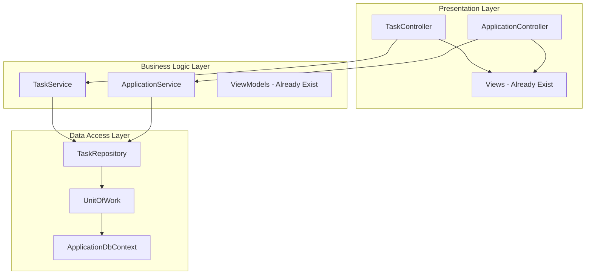

# TaskController & ApplicationController Implementation Plan

## Overview

This plan details the implementation of TaskController, ApplicationController, and their corresponding services. The Views and ViewModels already exist, so we need to create the services and controllers to connect them.

---

## Current State Analysis

### What Exists
| Component | Status | Location |
|-----------|--------|----------|
| Task Views | ✅ Complete | `LaborPL/Views/Task/` |
| Application Views | ✅ Complete | `LaborPL/Views/Application/` |
| TaskViewModels | ✅ Complete | `LaborBLL/ModelVM/TaskViewModels.cs` |
| TaskItem Entity | ✅ Complete | `LaborDAL/Entities/TaskItem.cs` |
| TaskApplication Entity | ✅ Complete | `LaborDAL/Entities/TaskApplication.cs` |
| TaskRepository | ✅ Complete | `LaborDAL/Repo/Implementation/TaskRepository.cs` |
| ITaskRepository | ✅ Complete | `LaborDAL/Repo/Abstract/ITaskRepository.cs` |
| UnitOfWork | ✅ Complete | `LaborDAL/Repo/Implementation/UnitOfWork.cs` |

### What's Missing
| Component | Location |
|-----------|----------|
| ITaskService | `LaborBLL/Service/Abstract/ITaskService.cs` |
| TaskService | `LaborBLL/Service/Implementation/TaskService.cs` |
| TaskController | `LaborPL/Controllers/TaskController.cs` |
| IApplicationService | `LaborBLL/Service/Abstract/IApplicationService.cs` |
| ApplicationService | `LaborBLL/Service/Implementation/ApplicationService.cs` |
| ApplicationController | `LaborPL/Controllers/ApplicationController.cs` |

---

## Architecture Flow



---

## Implementation Details

### 1. ITaskService Interface

**File:** `LaborBLL/Service/Abstract/ITaskService.cs`

```csharp
public interface ITaskService
{
    // Task CRUD Operations
    Task<Response<TaskDetailsViewModel>> GetTaskByIdAsync(int id, string? currentUserId = null);
    Task<Response<TaskListViewModel>> GetTaskListAsync(TaskSearchViewModel search, string? currentUserId = null);
    Task<Response<int>> CreateTaskAsync(CreateTaskViewModel model, string posterId);
    Task<Response<bool>> UpdateTaskAsync(EditTaskViewModel model, string posterId);
    Task<Response<bool>> DeleteTaskAsync(int taskId, string posterId);
    
    // Task Status Management
    Task<Response<bool>> AssignTaskAsync(int taskId, string workerId);
    Task<Response<bool>> StartTaskAsync(int taskId, string workerId);
    Task<Response<bool>> CompleteTaskAsync(int taskId);
    Task<Response<bool>> CancelTaskAsync(int taskId, string reason, string cancelledBy);
    
    // User-specific Task Lists
    Task<Response<IEnumerable<TaskListViewModel>>> GetMyTasksAsync(string posterId);
    Task<Response<IEnumerable<TaskListViewModel>>> GetAssignedTasksAsync(string workerId);
    
    // Utility Methods
    Task<Response<bool>> CanUserApplyAsync(int taskId, string userId);
    Task<Response<bool>> IncrementViewCountAsync(int taskId);
}
```

### 2. TaskService Implementation

**File:** `LaborBLL/Service/Implementation/TaskService.cs`

**Key Business Logic:**

1. **CreateTask Validation:**
   - User must have Poster role
   - Budget must be positive
   - Due date must be in the future (if provided)
   - Location coordinates must be valid (-90 to 90 lat, -180 to 180 lng)

2. **UpdateTask Authorization:**
   - Only poster can edit
   - Only Open tasks can be edited
   - Cannot change status through update

3. **DeleteTask Rules:**
   - Only poster can delete
   - Only Open or Cancelled tasks can be deleted
   - Soft delete preferred

4. **Task Status Transitions:**
   ```
   Open → Assigned (when application accepted)
   Assigned → InProgress (when worker starts)
   InProgress → Completed (when work done)
   Any → Cancelled (with reason)
   ```

### 3. TaskController

**File:** `LaborPL/Controllers/TaskController.cs`

**Actions Required:**

| Action | HTTP Method | Route | Authorization |
|--------|-------------|-------|---------------|
| Index | GET | /Task | All authenticated |
| Details | GET | /Task/Details/{id} | All authenticated |
| Create | GET | /Task/Create | Poster role |
| Create | POST | /Task/Create | Poster role |
| Edit | GET | /Task/Edit/{id} | Poster (owner) |
| Edit | POST | /Task/Edit/{id} | Poster (owner) |
| Delete | POST | /Task/Delete/{id} | Poster (owner) |
| MyTasks | GET | /Task/MyTasks | Poster role |
| Search | GET | /Task/Search | All authenticated |

### 4. IApplicationService Interface

**File:** `LaborBLL/Service/Abstract/IApplicationService.cs`

```csharp
public interface IApplicationService
{
    // Application CRUD
    Task<Response<int>> CreateApplicationAsync(CreateApplicationViewModel model, string workerId);
    Task<Response<TaskApplicationViewModel>> GetApplicationByIdAsync(int id);
    Task<Response<bool>> WithdrawApplicationAsync(int applicationId, string workerId);
    
    // Application Lists
    Task<Response<IEnumerable<TaskApplicationViewModel>>> GetApplicationsByTaskAsync(int taskId, string posterId);
    Task<Response<IEnumerable<TaskApplicationViewModel>>> GetApplicationsByWorkerAsync(string workerId);
    
    // Application Actions
    Task<Response<bool>> AcceptApplicationAsync(int applicationId, string posterId);
    Task<Response<bool>> RejectApplicationAsync(int applicationId, string posterId, string? reason);
    
    // Utility
    Task<Response<bool>> HasUserAppliedAsync(int taskId, string userId);
    Task<Response<int>> GetApplicationCountAsync(int taskId);
}
```

### 5. ApplicationService Implementation

**File:** `LaborBLL/Service/Implementation/ApplicationService.cs`

**Key Business Logic:**

1. **CreateApplication Validation:**
   - User must have Worker role
   - Task must be Open
   - User cannot apply to their own task
   - User cannot apply twice to same task
   - Verification tier check (unverified users limited to $100 tasks)

2. **AcceptApplication Logic:**
   - Only poster can accept
   - Task must be Open
   - Creates Booking automatically
   - Rejects other pending applications (optional)
   - Updates Task status to Assigned

3. **RejectApplication Logic:**
   - Only poster can reject
   - Records rejection reason
   - Notifies worker

### 6. ApplicationController

**File:** `LaborPL/Controllers/ApplicationController.cs`

**Actions Required:**

| Action | HTTP Method | Route | Authorization |
|--------|-------------|-------|---------------|
| Create | GET | /Application/Create/{taskId} | Worker role |
| Create | POST | /Application/Create | Worker role |
| ByTask | GET | /Application/ByTask/{taskId} | Poster (owner) |
| ByWorker | GET | /Application/ByWorker | Worker role |
| Accept | POST | /Application/Accept/{id} | Poster (owner) |
| Reject | POST | /Application/Reject/{id} | Poster (owner) |
| Withdraw | POST | /Application/Withdraw/{id} | Worker (owner) |

---

## View Requirements Analysis

### Task/Index.cshtml Requirements
- Uses `TaskSearchViewModel` with pagination
- Filters: Keyword, Category, MinBudget, MaxBudget, IsRemote, IsUrgent, Location, RadiusKm
- Sort options: newest, budget_high, budget_low, distance
- Shows: Task cards with poster info, application count, view count

### Task/Details.cshtml Requirements
- Uses `TaskDetailsViewModel`
- Shows: Full task info, poster details, assigned worker, applications
- Actions: Edit (if owner), Apply (if worker), Accept/Reject applications (if poster)

### Task/Create.cshtml Requirements
- Uses `CreateTaskViewModel`
- Fields: Title, Description, Category, Budget, Location (with map), Dates, Skills
- Map integration for location selection

### Application/Create.cshtml Requirements
- Uses `CreateApplicationViewModel`
- Shows task summary (from ViewBag)
- Fields: ProposedBudget, EstimatedHours, Message

### Application/ByPoster.cshtml Requirements
- Shows applications for poster's tasks
- Actions: Accept, Reject, View profile

### Application/ByWorker.cshtml Requirements
- Shows worker's applications
- Status badges, task details
- Action: Withdraw

---

## Dependency Injection Registration

**File:** `LaborPL/Program.cs`

Add to service registration:

```csharp
// Services
builder.Services.AddScoped<ITaskService, TaskService>();
builder.Services.AddScoped<IApplicationService, ApplicationService>();

// Repositories (if not already registered)
builder.Services.AddScoped<ITaskRepository, TaskRepository>();
builder.Services.AddScoped<IUnitOfWork, UnitOfWork>();
```

---

## AutoMapper Profile Updates

**File:** `LaborBLL/Mappper/AutoMapperProfile.cs`

Add mappings:

```csharp
// TaskItem mappings
CreateMap<TaskItem, TaskListViewModel>()
    .ForMember(dest => dest.CategoryDisplay, opt => opt.MapFrom(src => src.Category.ToString()))
    .ForMember(dest => dest.StatusDisplay, opt => opt.MapFrom(src => src.Status.ToString()))
    .ForMember(dest => dest.BudgetTypeDisplay, opt => opt.MapFrom(src => src.BudgetType.ToString()))
    .ForMember(dest => dest.PosterName, opt => opt.MapFrom(src => src.Poster.FirstName + " " + src.Poster.LastName))
    .ForMember(dest => dest.ApplicationCount, opt => opt.MapFrom(src => src.Applications.Count));

CreateMap<TaskItem, TaskDetailsViewModel>()
    .ForMember(dest => dest.CategoryDisplay, opt => opt.MapFrom(src => src.Category.ToString()))
    .ForMember(dest => dest.StatusDisplay, opt => opt.MapFrom(src => src.Status.ToString()))
    .ForMember(dest => dest.PosterName, opt => opt.MapFrom(src => src.Poster.FirstName + " " + src.Poster.LastName));

CreateMap<CreateTaskViewModel, TaskItem>();
CreateMap<EditTaskViewModel, TaskItem>();

// TaskApplication mappings
CreateMap<TaskApplication, TaskApplicationViewModel>()
    .ForMember(dest => dest.WorkerName, opt => opt.MapFrom(src => src.Workers.FirstOrDefault().FirstName + " " + src.Workers.FirstOrDefault().LastName))
    .ForMember(dest => dest.StatusDisplay, opt => opt.MapFrom(src => src.Status.ToString()));

CreateMap<CreateApplicationViewModel, TaskApplication>();
```

---

## Implementation Order

1. **ITaskService.cs** - Define interface
2. **TaskService.cs** - Implement business logic
3. **TaskController.cs** - Connect views to service
4. **IApplicationService.cs** - Define interface
5. **ApplicationService.cs** - Implement business logic
6. **ApplicationController.cs** - Connect views to service
7. **Program.cs** - Register DI services
8. **AutoMapperProfile.cs** - Add mappings (if needed)

---

## Error Handling

Use the existing `Response<T>` pattern:

```csharp
public class Response<T>
{
    public bool Success { get; set; }
    public T? Data { get; set; }
    public string? ErrorMessage { get; set; }
}
```

---

## Security Considerations

1. **Authorization Attributes:**
   - `[Authorize]` on all controllers
   - `[Authorize(Roles = "Poster")]` for task creation
   - `[Authorize(Roles = "Worker")]` for applications

2. **Ownership Checks:**
   - Verify user owns task before edit/delete
   - Verify user owns application before withdraw
   - Verify poster owns task before accept/reject

3. **Anti-Forgery:**
   - `[ValidateAntiForgeryToken]` on all POST actions

---

## Testing Checklist

- [ ] Create task as Poster
- [ ] Edit own task
- [ ] Delete own task
- [ ] View task list with filters
- [ ] View task details
- [ ] Apply to task as Worker
- [ ] Withdraw own application
- [ ] Accept application as Poster
- [ ] Reject application as Poster
- [ ] Cannot apply to own task
- [ ] Cannot apply twice to same task
- [ ] Cannot edit/delete others' tasks
