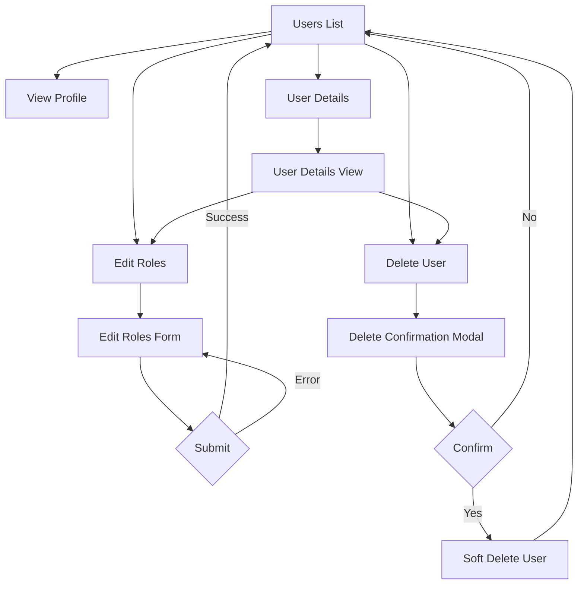

# User Management Enhancement Plan

## Overview
This plan outlines the implementation of three new features for the Admin User Management section:
1. **Delete User** - Allow admins to delete user accounts
2. **User Details** - View detailed information about a specific user
3. **Edit Roles** - Modify user roles (Worker, Poster, Admin)

## Current State Analysis

### Existing Components
- [`AdminController.cs`](LaborPL/Controllers/AdminController.cs) - Contains `Users()` action that lists all users
- [`Users.cshtml`](LaborPL/Views/Admin/Users.cshtml) - Displays user list with basic actions (View Profile, Edit Roles placeholder)
- [`IRoleService.cs`](LaborBLL/Service/Abstract/IRoleService.cs) - Service interface for role management
- [`RoleService.cs`](LaborBLL/Service/Implementation/RoleService.cs) - Implementation with `GetUserRolesAsync()`, `SetRolesAsync()`, `AddRoleAsync()`, `RemoveRoleAsync()`
- [`ProfileViewModel.cs`](LaborBLL/ModelVM/ProfileViewModel.cs) - ViewModel for user profile display
- [`ClientRole.cs`](LaborDAL/Enums/ClientRole.cs) - Flags enum with None, Worker, Poster, Both, Admin, AdminWorker, AdminPoster, AdminBoth

### Key Observations
- The `AppUser` entity has soft delete support (`IsDeleted`, `DeletedAt`, `DeletedBy`)
- `IRoleService` already has all needed methods for role management
- Current Users view has placeholder button for Edit Roles without functionality

---

## Implementation Plan

### 1. Create EditRolesViewModel

**File:** `LaborBLL/ModelVM/EditRolesViewModel.cs`

```csharp
namespace LaborBLL.ModelVM
{
    public class EditRolesViewModel
    {
        public string UserId { get; set; } = string.Empty;
        public string UserName { get; set; } = string.Empty;
        public string Email { get; set; } = string.Empty;
        
        // Role checkboxes
        public bool IsWorker { get; set; }
        public bool IsPoster { get; set; }
        public bool IsAdmin { get; set; }
        
        // Current role info for display
        public ClientRole CurrentRole { get; set; }
    }
}
```

### 2. AdminController Actions

#### 2.1 User Details Action
```csharp
// GET: /Admin/UserDetails/{id}
public async Task<IActionResult> UserDetails(string id)
{
    var user = await _userRepository.GetByIdAsync(id);
    if (user == null)
    {
        return NotFound();
    }
    
    var viewModel = _mapper.Map<ProfileViewModel>(user);
    return View(viewModel);
}
```

#### 2.2 Edit Roles GET Action
```csharp
// GET: /Admin/EditRoles/{id}
public async Task<IActionResult> EditRoles(string id)
{
    var user = await _userRepository.GetByIdAsync(id);
    if (user == null)
    {
        return NotFound();
    }
    
    var viewModel = new EditRolesViewModel
    {
        UserId = user.Id,
        UserName = $"{user.FirstName} {user.LastName}",
        Email = user.Email,
        IsWorker = user.Role.HasFlag(ClientRole.Worker),
        IsPoster = user.Role.HasFlag(ClientRole.Poster),
        IsAdmin = user.Role.HasFlag(ClientRole.Admin),
        CurrentRole = user.Role
    };
    
    return View(viewModel);
}
```

#### 2.3 Edit Roles POST Action
```csharp
// POST: /Admin/EditRoles
[HttpPost]
[ValidateAntiForgeryToken]
public async Task<IActionResult> EditRoles(EditRolesViewModel model)
{
    if (!ModelState.IsValid)
    {
        return View(model);
    }
    
    // Calculate new role
    ClientRole newRole = ClientRole.None;
    if (model.IsWorker) newRole |= ClientRole.Worker;
    if (model.IsPoster) newRole |= ClientRole.Poster;
    if (model.IsAdmin) newRole |= ClientRole.Admin;
    
    var result = await _roleService.SetRolesAsync(model.UserId, newRole);
    
    if (result)
    {
        TempData["SuccessMessage"] = "User roles updated successfully.";
        return RedirectToAction(nameof(Users));
    }
    
    ModelState.AddModelError("", "Failed to update user roles.");
    return View(model);
}
```

#### 2.4 Delete User Action
```csharp
// POST: /Admin/DeleteUser
[HttpPost]
[ValidateAntiForgeryToken]
public async Task<IActionResult> DeleteUser(string id)
{
    var user = await _userRepository.GetByIdAsync(id);
    if (user == null)
    {
        return NotFound();
    }
    
    // Prevent self-deletion
    var currentUserId = _userManager.GetUserId(User);
    if (id == currentUserId)
    {
        TempData["ErrorMessage"] = "You cannot delete your own account.";
        return RedirectToAction(nameof(Users));
    }
    
    // Soft delete
    user.IsDeleted = true;
    user.DeletedAt = DateTime.UtcNow;
    user.DeletedBy = currentUserId;
    
    await _userRepository.UpdateAsync(user);
    
    TempData["SuccessMessage"] = "User deleted successfully.";
    return RedirectToAction(nameof(Users));
}
```

### 3. View Files

#### 3.1 UserDetails.cshtml
**File:** `LaborPL/Views/Admin/UserDetails.cshtml`

Key sections:
- User profile header with avatar
- Contact information (email, phone, location)
- Account status (verified, roles, rating)
- Activity summary (tasks posted, tasks completed, applications)
- Action buttons (Edit Roles, Delete, Back to List)

#### 3.2 EditRoles.cshtml
**File:** `LaborPL/Views/Admin/EditRoles.cshtml`

Key sections:
- User info display (name, email)
- Role checkboxes with descriptions:
  - Worker: Can apply for tasks and perform work
  - Poster: Can post tasks and hire workers
  - Admin: Full system access
- Warning message for Admin role assignment
- Save/Cancel buttons

#### 3.3 Updated Users.cshtml
**File:** `LaborPL/Views/Admin/Users.cshtml`

Changes:
- Add Details button linking to UserDetails action
- Add Delete button with data attributes for modal
- Add delete confirmation modal
- Wire up the Edit Roles button to actual action

---

## UI Flow Diagram



---

## Files to Create/Modify

### New Files
| File | Purpose |
|------|---------|
| `LaborBLL/ModelVM/EditRolesViewModel.cs` | ViewModel for role editing |
| `LaborPL/Views/Admin/UserDetails.cshtml` | User details view |
| `LaborPL/Views/Admin/EditRoles.cshtml` | Edit roles form view |

### Modified Files
| File | Changes |
|------|---------|
| `LaborPL/Controllers/AdminController.cs` | Add UserDetails, EditRoles (GET/POST), DeleteUser actions |
| `LaborPL/Views/Admin/Users.cshtml` | Add Details/Delete buttons, delete modal, fix Edit Roles link |

---

## Security Considerations

1. **Authorization**: All actions already protected by `[Authorize(Roles = "Admin")]`
2. **Self-deletion prevention**: Admin cannot delete their own account
3. **CSRF protection**: All POST actions use `[ValidateAntiForgeryToken]`
4. **Soft delete**: Users are soft-deleted, not permanently removed
5. **Role validation**: Ensure at least one role is assigned (optional validation)

---

## Dependencies to Inject

The AdminController will need:
- `IRoleService _roleService` - For role management
- `UserManager<AppUser> _userManager` - For getting current user ID

---

## Ready for Implementation

This plan is ready for implementation in Code mode. The changes are:
- Well-scoped and focused
- Follow existing project patterns
- Use existing services and infrastructure
- Maintain security best practices
