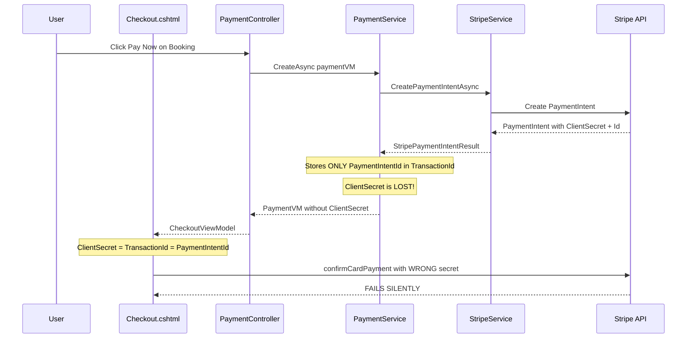

# Payment "Pay Now" Button Fix Plan

## Problem Description
When clicking "Pay Now" to pay for a booking, nothing happens. The payment is not processed.

## Root Cause Analysis

The issue is in the payment flow where the **ClientSecret** is not being properly stored or passed to the frontend.

### Code Flow Analysis



### Specific Issues Found

1. **In [`PaymentService.CreateAsync()`](../LaborBLL/Service/Implementation/PaymentService.cs:63)**:
   ```csharp
   model.TransactionId = Intent.PaymentIntentId;  // Only stores PaymentIntentId
   // ClientSecret is NOT stored anywhere!
   ```

2. **In [`PaymentController.Checkout()`](../LaborPL/Controllers/PaymentController.cs:141)**:
   ```csharp
   ClientSecret = payment.TransactionId, // This is PaymentIntentId, NOT ClientSecret!
   ```

3. **In [`Checkout.cshtml`](../LaborPL/Views/Payment/Checkout.cshtml:45)**:
   ```javascript
   stripe.confirmCardPayment('@Model.ClientSecret', {...})
   // ClientSecret is actually PaymentIntentId - WRONG!
   ```

### Why This Causes the Issue

Stripe's `confirmCardPayment()` requires the **ClientSecret** which has the format:
- `pi_xxx_secret_yyy`

But the code is passing the **PaymentIntentId** which has the format:
- `pi_xxx`

When Stripe receives an invalid ClientSecret, the payment confirmation fails silently or throws an error that may not be displayed to the user.

## Solution

### Option 1: Store ClientSecret in Database (Recommended)

1. **Add `ClientSecret` field to Payment entity**:
   - Add a new column to store the ClientSecret
   - This allows reusing the secret if the user refreshes the page

2. **Update PaymentService.CreateAsync()**:
   - Store both `PaymentIntentId` and `ClientSecret`

3. **Update PaymentController.Checkout()**:
   - Use the stored `ClientSecret` from the payment record

### Option 2: Retrieve ClientSecret from Stripe (Alternative)

1. **In PaymentController.Checkout()**:
   - Retrieve the PaymentIntent from Stripe API
   - Get the ClientSecret from the retrieved PaymentIntent

This option requires an additional API call but doesn't require database changes.

## Recommended Implementation (Option 1)

### Step 1: Add ClientSecret to Payment Entity
File: [`LaborDAL/Entities/Payment.cs`](../LaborDAL/Entities/Payment.cs)

Add a new property:
```csharp
[StringLength(100)]
public string? ClientSecret { get; set; }
```

### Step 2: Create Migration
Run: `dotnet ef migrations add AddClientSecretToPayment`

### Step 3: Update PaymentService
File: [`LaborBLL/Service/Implementation/PaymentService.cs`](../LaborBLL/Service/Implementation/PaymentService.cs)

In `CreateAsync()` method, store the ClientSecret:
```csharp
model.TransactionId = Intent.PaymentIntentId;
// Add this line:
paymentEntity.ClientSecret = Intent.ClientSecret;
```

### Step 4: Update PaymentVM
File: [`LaborBLL/ModelVM/PaymentVM.cs`](../LaborBLL/ModelVM/PaymentVM.cs)

Add:
```csharp
public string? ClientSecret { get; set; }
```

### Step 5: Update AutoMapper Profile
File: [`LaborBLL/Mappper/AutoMapperProfile.cs`](../LaborBLL/Mappper/AutoMapperProfile.cs)

Ensure ClientSecret is mapped between Payment and PaymentVM.

### Step 6: Update PaymentController
File: [`LaborPL/Controllers/PaymentController.cs`](../LaborPL/Controllers/PaymentController.cs)

In `Checkout()` method:
```csharp
var viewModel = new CheckoutViewModel
{
    BookingId = bookingId,
    Amount = booking.AgreedRate,
    ClientSecret = payment.ClientSecret, // Use the actual ClientSecret
    PubishableKey = _configuration["Stripe:PublishableKey"]
};
```

## Testing Plan

1. Create a new booking
2. Navigate to the checkout page
3. Enter test card details (Stripe test card: 4242 4242 4242 4242)
4. Click "Pay Now"
5. Verify payment is processed successfully
6. Check the database for correct payment status

## Additional Recommendations

1. **Add error handling in Checkout.cshtml**:
   - Display errors more prominently
   - Add loading state during payment processing

2. **Add logging**:
   - Log payment creation and confirmation steps
   - Log any Stripe errors for debugging
