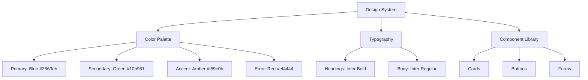

# LaborMVC - UI/UX Redesign Plan for Person 1 (Current User)

## Executive Summary
This document outlines a comprehensive UI/UX redesign plan for the LaborMVC marketplace application, focusing on creating a modern, consistent, and user-friendly experience for the logged-in user ("Person 1").

---

## Current State Analysis

### Existing Views (User-Facing)
| Area | Views | Status |
|------|-------|--------|
| **Account** | Login, Register, MyProfile, Profile | ✅ Working |
| **Dashboard** | Worker, Poster, Combined, Admin | ✅ Working |
| **Tasks** | Index, Details, Create, Edit, MyTasks | ✅ Working |
| **Bookings** | Dashboard, Details, Create, ProfilePoster | ✅ Working |
| **Applications** | ByWorker, ByPoster, Create | ✅ Working |
| **Payments** | Index, Checkout, Details, Status, History | ✅ Working |
| **Chat** | Index, Conversation | ✅ Working |
| **Messages** | Chat, Contacts | ✅ Working |
| **Ratings** | GetMyRate | ✅ Working |

### Identified Issues
1. **Inconsistent Styling** - Different card designs, button styles, and layouts across pages
2. **Limited Visual Hierarchy** - Need better use of shadows, spacing, and typography
3. **Missing Animations** - No micro-interactions or transitions
4. **Color Scheme** - No unified brand colors
5. **Responsive Gaps** - Some pages may not be fully mobile-optimized

---

## Redesign Goals

### Phase 1: Design System Foundation


### Phase 2: Core Page Redesigns
| Priority | Page | Current State | Target State |
|----------|------|---------------|--------------|
| P1 | MyProfile | Basic form | Modern card with stats, map, Stripe |
| P1 | Dashboard (Worker/Poster) | Tables | Dashboard widgets with charts |
| P1 | Task Details | Dense layout | Clean card with actions |
| P2 | Booking Dashboard | Simple list | Kanban-style board |
| P2 | Chat Interface | Basic | Modern messenger UI |
| P3 | Payment History | Table | Timeline cards |

---

## Detailed Page Redesigns

### 1. MyProfile Page (HIGH PRIORITY)
**File:** `Views/Account/MyProfile.cshtml`

**Current Features:**
- Profile form with location detection
- Worker/Poster statistics
- Stripe Connect for workers
- Reviews section

**Redesign Goals:**
- Split into tabs: Profile Info | Statistics | Reviews
- Add profile completeness indicator
- Enhance location section with interactive map preview
- Add profile picture upload with crop
- Show earning/payment summary for workers

**Proposed Layout:**
```
┌─────────────────────────────────────────────────────┐
│  [Avatar]  John Doe                    [Edit Button] │
│            ★★★★☆ (4.5) · 23 Reviews               │
│            [ID Verified Badge]                      │
├─────────────────────────────────────────────────────┤
│  [📋 Info] [📊 Stats] [⭐ Reviews]                 │
├─────────────────────────────────────────────────────┤
│  Tab Content Area                                   │
│  - Info: Form fields with icons                    │
│  - Stats: Animated counters                        │
│  - Reviews: Card-based review list                 │
└─────────────────────────────────────────────────────┘
```

### 2. Dashboard Pages (HIGH PRIORITY)
**Files:** 
- `Views/Dashboard/Worker.cshtml`
- `Views/Dashboard/Poster.cshtml`
- `Views/Dashboard/Combined.cshtml`

**Current Features:**
- Statistics cards
- Recent bookings list
- Task applications

**Redesign Goals:**
- Add welcome message with user name
- Create widget-based layout
- Add quick action buttons
- Include mini analytics charts
- Add "At a Glance" summary cards

**Proposed Layout:**
```
┌─────────────────────────────────────────────────────┐
│  Welcome back, John! 👋                             │
│  Here's what's happening today                      │
├──────────────┬──────────────┬──────────────┬───────┤
│ 📋 Active    │ ✅ Completed │ 💰 Earnings  │ ⭐ Avg │
│    Jobs      │    Today     │   This Month │ Rating│
│     3        │      5       │   $1,250    │  4.5  │
└──────────────┴──────────────┴──────────────┴───────┘
┌─────────────────────────────────────────────────────┐
│  📌 Quick Actions                                   │
│  [+ Post Task]  [🔍 Browse Tasks]  [💬 Messages]   │
└─────────────────────────────────────────────────────┘
┌─────────────────────────────────────────────────────┐
│  📋 Recent Bookings                    [View All]  │
│  ┌─────────────────────────────────────────────┐   │
│  │ Plumbing Job - John     📍 Cairo   $150     │   │
│  │ Status: In Progress                         │   │
│  └─────────────────────────────────────────────┘   │
└─────────────────────────────────────────────────────┘
```

### 3. Task Details Page (HIGH PRIORITY)
**File:** `Views/Task/Details.cshtml`

**Current Features:**
- Task information
- Posted by user info
- Apply/Book buttons

**Redesign Goals:**
- Hero-style header with task title and status
- Floating action buttons on mobile
- Better user card design
- Related tasks sidebar
- Map showing task location

### 4. Booking Dashboard (MEDIUM PRIORITY)
**File:** `Views/Booking/Dashboard.cshtml`

**Redesign Goals:**
- Implement Kanban-style board (To Do | In Progress | Completed | Disputed)
- Drag-and-drop functionality
- Filter chips for status
- Booking cards with progress indicator

### 5. Chat Interface (MEDIUM PRIORITY)
**Files:** 
- `Views/Chat/Index.cshtml`
- `Views/Chat/Conversation.cshtml`

**Redesign Goals:**
- Modern messenger UI (like WhatsApp/WebChat)
- Contact list with online status
- Message bubbles with timestamps
- Typing indicator
- File/image sharing preview

### 6. Payment Pages (MEDIUM PRIORITY)
**Files:**
- `Views/Payment/Index.cshtml`
- `Views/Payment/MyPaymentHistory.cshtml`

**Redesign Goals:**
- Timeline view for payment history
- Status badges with colors
- Receipt download buttons
- Summary cards (Total Earned | Pending | Withdrawn)

---

## Implementation Roadmap

### Sprint 1: Foundation (Week 1)
- [ ] Create shared CSS with design tokens
- [ ] Update `_Layout.cshtml` with new navbar
- [ ] Create reusable card components
- [ ] Add Bootstrap enhancements (shadows, borders)

### Sprint 2: Core Pages (Week 2)
- [ ] Redesign MyProfile
- [ ] Redesign Dashboard (Worker/Poster)
- [ ] Update Task Details

### Sprint 3: Secondary Pages (Week 3)
- [ ] Redesign Booking Dashboard
- [ ] Redesign Chat Interface
- [ ] Update Payment History

### Sprint 4: Polish (Week 4)
- [ ] Add animations/transitions
- [ ] Responsive testing
- [ ] Performance optimization
- [ ] Cross-browser testing

---

## Technical Specifications

### CSS Variables (Proposed)
```css
:root {
    /* Primary Colors */
    --color-primary: #2563eb;
    --color-primary-dark: #1d4ed8;
    --color-primary-light: #3b82f6;
    
    /* Secondary Colors */
    --color-success: #10b981;
    --color-warning: #f59e0b;
    --color-danger: #ef4444;
    --color-info: #06b6d4;
    
    /* Neutral Colors */
    --color-gray-50: #f9fafb;
    --color-gray-100: #f3f4f6;
    --color-gray-200: #e5e7eb;
    --color-gray-700: #374151;
    --color-gray-900: #111827;
    
    /* Shadows */
    --shadow-sm: 0 1px 2px 0 rgb(0 0 0 / 0.05);
    --shadow-md: 0 4px 6px -1px rgb(0 0 0 / 0.1);
    --shadow-lg: 0 10px 15px -3px rgb(0 0 0 / 0.1);
    
    /* Border Radius */
    --radius-sm: 0.375rem;
    --radius-md: 0.5rem;
    --radius-lg: 0.75rem;
    --radius-xl: 1rem;
}
```

### Recommended Libraries
1. **Bootstrap Icons** - Already included ✅
2. **AOS (Animate On Scroll)** - For scroll animations
3. **Chart.js** - For dashboard charts
4. **SweetAlert2** - For modern alerts/modals

---

## Files to Modify

### Primary Files
| File | Purpose |
|------|---------|
| `Views/Shared/_Layout.cshtml` | Main layout with navbar |
| `wwwroot/css/site.css` | Global styles |
| `Views/Account/MyProfile.cshtml` | Profile page |
| `Views/Dashboard/Worker.cshtml` | Worker dashboard |
| `Views/Dashboard/Poster.cshtml` | Poster dashboard |
| `Views/Task/Details.cshtml` | Task details |

### Supporting Components
| File | Purpose |
|------|---------|
| `Views/Shared/_Sidebar.cshtml` | Sidebar navigation (new) |
| `Views/Shared/_StatCard.cshtml` | Reusable stat card (new) |
| `Views/Shared/_BookingCard.cshtml` | Booking card (new) |

---

## Success Metrics

### Visual Consistency
- [ ] All pages use consistent color palette
- [ ] Typography hierarchy is clear
- [ ] Spacing is consistent (8px grid)

### User Experience
- [ ] Page load time < 3 seconds
- [ ] Mobile-responsive at 320px width
- [ ] All interactive elements have hover states
- [ ] Forms have clear validation feedback

### Functionality
- [ ] All existing features preserved
- [ ] Navigation is intuitive
- [ ] Quick actions are easily accessible
