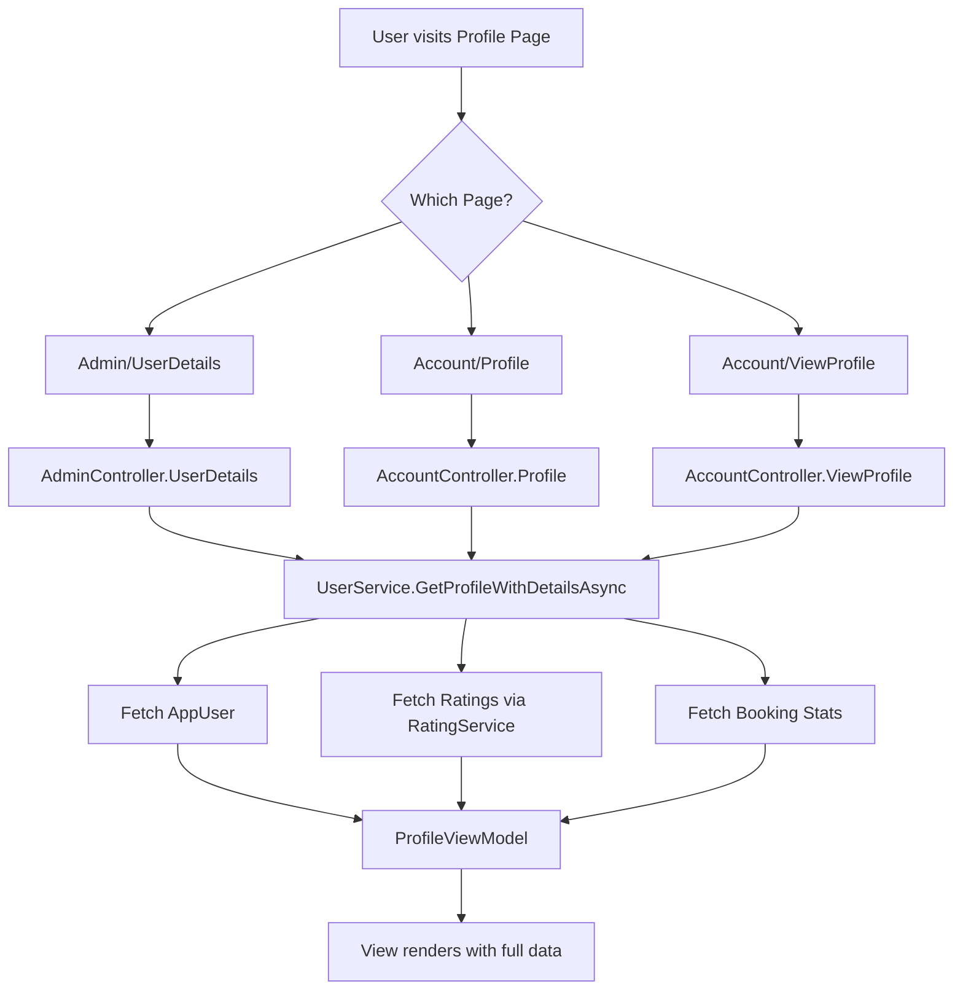

# Profile Pages Revision Plan

## Overview
This document outlines the comprehensive revision plan for three profile pages:
1. **Admin/UserDetails** (`/Admin/UserDetails/{id}`) - Admin-only view
2. **Account/Profile** (`/Account/Profile`) - Current user's own profile (MyProfile)
3. **Account/ViewProfile** (`/Account/ViewProfile/{id}`) - Public profile visible to others

## Current Issues Identified

### 1. Rating Data
- `ProfileViewModel.AverageRating` exists but may not be populated correctly
- Individual ratings list is not included in profile views
- Rating details (rater name, comment, date, booking) not displayed

### 2. Role-Specific Data
- No differentiation between Worker and Poster stats
- Missing: completed jobs count, tasks posted count, earnings (for workers)
- Missing: total spending, hires count (for posters)

### 3. Data Flow Issues
- `UserService.GetProfileAsync()` only maps basic user data via AutoMapper
- Doesn't fetch ratings from `RatingService`
- Doesn't compute role-specific statistics

---

## Implementation Plan

### Phase 1: Data Model Enhancements

#### 1.1 Enhance ProfileViewModel
**File:** `LaborBLL/ModelVM/ProfileViewModel.cs`

Add new properties:
```csharp
// Rating details
public int TotalRatingsReceived { get; set; }
public List<AllRatingViewModel> Ratings { get; set; }

// Worker-specific stats
public int CompletedJobsAsWorker { get; set; }
public decimal TotalEarnings { get; set; }

// Poster-specific stats  
public int TasksPosted { get; set; }
public int TotalHires { get; set; }
public decimal TotalSpent { get; set; }

// Additional profile fields
public bool IsEmailVerified { get; set; }
public bool IsPhoneVerified { get; set; }
public DateTime? LastActiveAt { get; set; }
```

#### 1.2 Add GetProfileWithDetails Method to IUserService
**File:** `LaborBLL/Service/Abstract/IUserService.cs`

Add new interface method:
```csharp
Task<ProfileViewModel?> GetProfileWithDetailsAsync(string userId, string? viewerId = null);
```

### Phase 2: Service Layer Updates

#### 2.1 Update UserService Implementation
**File:** `LaborBLL/Service/Implementation/UserService.cs`

Update `GetProfileAsync` or create new `GetProfileWithDetailsAsync`:
1. Fetch user from UserManager
2. Fetch ratings via RatingService
3. Fetch booking statistics from unitOfWork
4. Map to ProfileViewModel with all data

#### 2.2 Update AdminController
**File:** `LaborPL/Controllers/AdminController.cs`

Update `UserDetails` action:
1. Use new `GetProfileWithDetailsAsync` method
2. Pass full profile data to view
3. Include all ratings and statistics

### Phase 3: View Updates

#### 3.1 Revise Admin/UserDetails.cshtml
**File:** `LaborPL/Views/Admin/UserDetails.cshtml`

Add sections:
- Individual ratings list with comments
- Worker stats (completed jobs, earnings)
- Poster stats (tasks posted, hires, spent)
- Account activity (created, last active)
- Edit roles button (already exists)

#### 3.2 Revise Account/Profile.cshtml (MyProfile)
**File:** `LaborPL/Views/Account/Profile.cshtml`

Add sections:
- Individual ratings received (with comments)
- Worker/Poster stats based on current role
- Link to rating details page
- Edit form (already exists)

#### 3.3 Revise Account/ViewProfile.cshtml
**File:** `LaborPL/Views/Account/ViewProfile.cshtml`

Add sections:
- Individual ratings with comments
- Role-specific stats (appropriate to viewed user's role)
- "Contact" or "Hire" action buttons (if applicable)

---

## Data Flow Diagram



---

## Files to Modify

| File | Changes |
|------|---------|
| `LaborBLL/ModelVM/ProfileViewModel.cs` | Add rating/stats properties |
| `LaborBLL/Service/Abstract/IUserService.cs` | Add new interface method |
| `LaborBLL/Service/Implementation/UserService.cs` | Implement GetProfileWithDetailsAsync |
| `LaborPL/Controllers/AdminController.cs` | Update UserDetails action |
| `LaborPL/Controllers/AccountController.cs` | Update Profile & ViewProfile actions |
| `LaborPL/Views/Admin/UserDetails.cshtml` | Add ratings/stats sections |
| `LaborPL/Views/Account/Profile.cshtml` | Add ratings/stats sections |
| `LaborPL/Views/Account/ViewProfile.cshtml` | Add ratings/stats sections |

---

## Acceptance Criteria

1. **Admin/UserDetails** shows:
   - Average rating with star display
   - List of all individual ratings with comments
   - Worker stats: completed jobs count, total earnings
   - Poster stats: tasks posted count, hires count, total spent
   - Edit Roles button

2. **Account/Profile (MyProfile)** shows:
   - Average rating with star display
   - List of ratings received (for workers)
   - Role-specific statistics
   - Edit profile form

3. **Account/ViewProfile** shows:
   - Average rating with star display
   - Individual ratings (publicly visible ones)
   - Appropriate role-specific stats
   - No edit functionality (read-only)

---

## Implementation Priority

1. **High Priority:** Fix rating display (AverageRating)
2. **High Priority:** Add individual ratings list
3. **Medium Priority:** Add role-specific statistics
4. **Low Priority:** Additional profile fields (verification status, activity)

